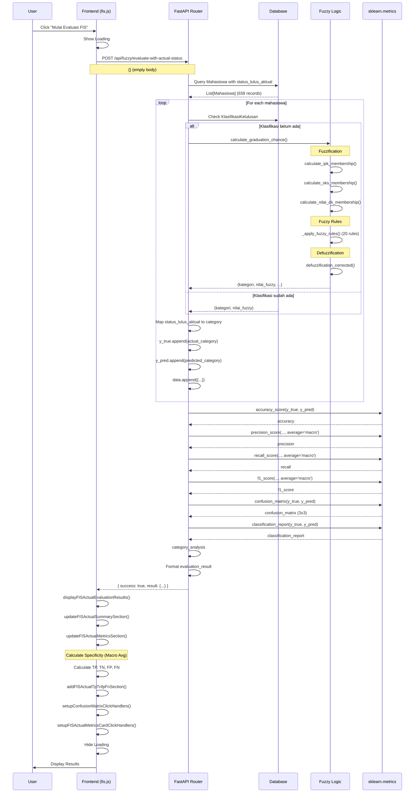

# Dokumentasi Alur Evaluasi FIS dengan Data Aktual

## 📋 Daftar Isi
1. [Overview](#overview)
2. [Diagram Alur Lengkap](#diagram-alur-lengkap)
3. [Detail Proses Frontend](#detail-proses-frontend)
4. [Detail Proses Backend](#detail-proses-backend)
5. [Function Reference](#function-reference)
6. [Contoh Request & Response](#contoh-request--response)
7. [Perhitungan Metrics](#perhitungan-metrics)
8. [Perbedaan dengan Klasifikasi FIS Biasa](#perbedaan-dengan-klasifikasi-fis-biasa)
9. [Diagram Sequence](#diagram-sequence)

---

## Overview

Evaluasi FIS dengan Data Aktual adalah proses untuk mengukur performa metode **Fuzzy Inference System (FIS)** dengan membandingkan hasil prediksi FIS terhadap label aktual yang sudah ada di database (`status_lulus_aktual`).

**Tujuan:**
- Mengukur akurasi metode FIS dalam memprediksi peluang kelulusan
- Menghitung metrik evaluasi: Accuracy, Precision, Recall, F1-Score, Specificity
- Menampilkan Confusion Matrix untuk analisis detail
- Membandingkan prediksi FIS dengan status aktual mahasiswa

**Data yang Digunakan:**
- Hanya mahasiswa yang memiliki `status_lulus_aktual` dengan nilai:
  - `LULUS_TINGGI`
  - `LULUS_SEDANG`
  - `LULUS_KECIL`
- Total data: **658 mahasiswa** (dari 9814 total mahasiswa)

**Perbedaan dengan Klasifikasi FIS Biasa:**
- **Klasifikasi FIS:** Menghitung fuzzy score dan klasifikasi untuk semua mahasiswa
- **Evaluasi FIS dengan Data Aktual:** Membandingkan prediksi FIS dengan label aktual untuk mengukur performa

---

## Diagram Alur Lengkap

```
┌─────────────────────────────────────────────────────────────────────────┐
│                           FRONTEND (Browser)                             │
└─────────────────────────────────────────────────────────────────────────┘
                                    │
                                    │ 1. User Click
                                    ▼
                    ┌───────────────────────────────┐
                    │  initializeFISActualEvaluation()│
                    │  initializeFISActualEvaluationHandlers()│
                    └───────────────┬───────────────┘
                                    │
                                    │ 2. Bind Events
                                    ▼
                    ┌───────────────────────────────┐
                    │  $("#fisActualEvaluationBtn")  │
                    │  .click() handler              │
                    └───────────────┬───────────────┘
                                    │
                                    │ 3. User Click Button
                                    ▼
                    ┌───────────────────────────────┐
                    │  evaluateFISWithActualStatusFromSection()│
                    │  - Show loading                │
                    │  - Disable button              │
                    └───────────────┬───────────────┘
                                    │
                                    │ 4. HTTP POST Request
                                    ▼
┌─────────────────────────────────────────────────────────────────────────┐
│                    HTTP REQUEST (AJAX)                                   │
│  POST /api/fuzzy/evaluate-with-actual-status                            │
│  Body: {} (empty - backend menggunakan semua data berlabel)              │
└─────────────────────────────────────────────────────────────────────────┘
                                    │
                                    ▼
┌─────────────────────────────────────────────────────────────────────────┐
│                        BACKEND (FastAPI)                                 │
└─────────────────────────────────────────────────────────────────────────┘
                                    │
                                    │ 5. Router Handler
                                    ▼
                    ┌───────────────────────────────┐
                    │  @router.post("/evaluate-with-actual-status")│
                    │  evaluate_fis_with_actual_status()│
                    └───────────────┬───────────────┘
                                    │
                                    │ 6. Query Database
                                    ▼
                    ┌───────────────────────────────┐
                    │  db.query(Mahasiswa)          │
                    │  .filter(                     │
                    │    status_lulus_aktual.isnot(None)│
                    │  )                           │
                    │  .all()                      │
                    └───────────────┬───────────────┘
                                    │
                                    │ 7. Validasi Data
                                    ▼
                    ┌───────────────────────────────┐
                    │  Cek jumlah data >= 10         │
                    │  Filter data valid            │
                    │  (status_lulus_aktual valid)   │
                    └───────────────┬───────────────┘
                                    │
                                    │ 8. Setup Mapping
                                    ▼
                    ┌───────────────────────────────┐
                    │  kategori_mapping = {         │
                    │    "Peluang Lulus Tinggi": 0,  │
                    │    "Peluang Lulus Sedang": 1, │
                    │    "Peluang Lulus Kecil": 2   │
                    │  }                            │
                    │  status_mapping = {           │
                    │    "LULUS_TINGGI": "Peluang Lulus Tinggi",│
                    │    "LULUS_SEDANG": "Peluang Lulus Sedang",│
                    │    "LULUS_KECIL": "Peluang Lulus Kecil"  │
                    │  }                            │
                    └───────────────┬───────────────┘
                                    │
                                    │ 9. Loop Mahasiswa
                                    ▼
        ┌───────────────────────────────────────────┐
        │  Untuk setiap mahasiswa:                  │
        │  1. Cek klasifikasi FIS di DB             │
        │  2. Jika belum ada, hitung FIS:           │
        │     - fuzzy_system.calculate_graduation_chance()│
        │     - Fuzzifikasi (IPK, SKS, DEK)         │
        │     - Fuzzy Rules (20 rules)              │
        │     - Defuzzifikasi                       │
        │     - Klasifikasi                         │
        │  3. Map status aktual ke kategori         │
        │  4. Collect y_true, y_pred, data         │
        └───────────────────┬───────────────────────┘
                            │
                            │ 10. Calculate Metrics
                            ▼
        ┌───────────────────────────────────────────┐
        │  Menggunakan sklearn.metrics:            │
        │  - accuracy_score(y_true, y_pred)        │
        │  - precision_score(..., average='macro') │
        │  - recall_score(..., average='macro')   │
        │  - f1_score(..., average='macro')        │
        │  - confusion_matrix(y_true, y_pred)      │
        │  - classification_report()                │
        └───────────────────┬───────────────────────┘
                            │
                            │ 11. Category Analysis
                            ▼
        ┌───────────────────────────────────────────┐
        │  Analisis per kategori:                   │
        │  - Total predictions per kategori        │
        │  - Correct predictions                    │
        │  - Accuracy per kategori                 │
        │  - Status breakdown                       │
        └───────────────────┬───────────────────────┘
                            │
                            │ 12. Format Response
                            ▼
                    ┌───────────────────────────────┐
                    │  evaluation_result = {         │
                    │    evaluation_info,            │
                    │    metrics,                    │
                    │    confusion_matrix,            │
                    │    classification_report,       │
                    │    classification_distribution,│
                    │    category_analysis,          │
                    │    statistics,                  │
                    │    full_data, ...               │
                    │  }                            │
                    └───────────────┬───────────────┘
                                    │
                                    │ 13. HTTP Response
                                    ▼
┌─────────────────────────────────────────────────────────────────────────┐
│                    HTTP RESPONSE (JSON)                                  │
│  Status: 200 OK                                                          │
│  Body: { success: true, result: {...} }                                    │
└─────────────────────────────────────────────────────────────────────────┘
                                    │
                                    ▼
┌─────────────────────────────────────────────────────────────────────────┐
│                           FRONTEND (Browser)                             │
└─────────────────────────────────────────────────────────────────────────┘
                                    │
                                    │ 14. Success Handler
                                    ▼
                    ┌───────────────────────────────┐
                    │  success: function(response)   │
                    │  - displayFISActualEvaluationResults()│
                    │  - Update semua sections      │
                    └───────────────┬───────────────┘
                                    │
                                    │ 15. Display Results
                                    ▼
                    ┌───────────────────────────────┐
                    │  displayFISActualEvaluationResults()│
                    │  - updateFISActualSummarySection()│
                    │  - updateFISActualMetricsSection()│
                    │  - updateFISActualCategorySection()│
                    │  - updateFISActualSampleSection()│
                    └───────────────┬───────────────┘
                                    │
                                    │ 16. Update Metrics
                                    ▼
                    ┌───────────────────────────────┐
                    │  updateFISActualMetricsSection()│
                    │  - Calculate Specificity (Macro Avg)│
                    │  - Update confusion matrix     │
                    │  - Calculate TP, TN, FP, FN   │
                    │  - Add TP/TN/FP/FN section    │
                    │  - Setup click handlers        │
                    └───────────────┬───────────────┘
                                    │
                                    │ 17. User Interaction
                                    ▼
                    ┌───────────────────────────────┐
                    │  - Click confusion matrix cell │
                    │    → Show modal detail data    │
                    │  - Click metric card           │
                    │    → Show modal explanation    │
                    │  - Click TP/TN/FP/FN card     │
                    │    → Show modal explanation    │
                    │  - Search/filter grid          │
                    │  - Export data                 │
                    └───────────────────────────────┘
```

---

## Detail Proses Frontend

### 1. Inisialisasi Section

**File:** `src/frontend/js/fis.js`

**Function:** `initializeFISActualEvaluation()`

**Proses:**
1. **Initialize event handlers** - `initializeFISActualEvaluationHandlers()`
2. **Setup click handlers** untuk tombol evaluasi, export, print

### 2. Bind Events

**Function:** `initializeFISActualEvaluationHandlers()`

**Event Handlers:**
- **Evaluate button** - `#fisActualEvaluationBtn`
- **Export button** - `#fisActualExportBtn`
- **Print button** - `#fisActualPrintBtn`

### 3. Evaluate FIS with Actual Status

**Function:** `evaluateFISWithActualStatusFromSection()`

**Proses:**

#### 3.1. Show Loading
```javascript
$('#fisActualEvaluationLoadingIndicator').show();
$('#fisActualSummarySection, #fisActualMetricsSection, ...').hide();
$('#fisActualEvaluationBtn').prop('disabled', true)
    .html('<i class="fas fa-spinner fa-spin"></i> Mengevaluasi...');
```

#### 3.2. Send HTTP Request
```javascript
$.ajax({
    url: CONFIG.getApiUrl(CONFIG.ENDPOINTS.FUZZY) + '/evaluate-with-actual-status',
    method: 'POST',
    contentType: 'application/json',
    data: JSON.stringify({
        // Backend akan otomatis menggunakan semua data berlabel
    }),
    timeout: 60000, // 60 seconds
    success: function(response) {
        displayFISActualEvaluationResults(response.result);
    }
});
```

### 4. Display Results

**Function:** `displayFISActualEvaluationResults(result)`

**Proses:**
1. **Update summary section** - `updateFISActualSummarySection(result)`
2. **Update metrics section** - `updateFISActualMetricsSection(result)`
3. **Update category section** - `updateFISActualCategorySection(result)`
4. **Update sample section** - `updateFISActualSampleSection(result)`
5. **Store full data** untuk modal confusion matrix
6. **Show all sections**

### 5. Update Metrics Section

**Function:** `updateFISActualMetricsSection(result)`

**Proses:**

#### 5.1. Store Data
```javascript
fisActualEvaluationFullData = result.full_data || result.results || [];
fisActualMetricsData = {
    precision: metrics.precision || 0,
    recall: metrics.recall || 0,
    f1_score: metrics.f1_score || 0,
    specificity: 0, // Akan dihitung
    accuracy: metrics.accuracy || 0
};
fisActualConfusionMatrix = cm;
```

#### 5.2. Update Overall Metrics
```javascript
$('#fisActualAccuracy').text((metrics.accuracy * 100).toFixed(2) + '%');
$('#fisActualPrecision').text((metrics.precision * 100).toFixed(2) + '%');
$('#fisActualRecall').text((metrics.recall * 100).toFixed(2) + '%');
$('#fisActualF1Score').text((metrics.f1_score * 100).toFixed(2) + '%');
```

#### 5.3. Calculate Specificity (Macro Average)
```javascript
// Specificity per kelas = TN_i / (TN_i + FP_i)
cm.forEach((row, i) => {
    // FP untuk kelas i = sum of off-diagonal dalam baris i
    const fpClass = row.reduce((sum, cell, j) => 
        sum + (j !== i ? (cell || 0) : 0), 0);
    
    // TN untuk kelas i = sum of all elements yang bukan di baris i dan bukan di kolom i
    let tnClass = 0;
    cm.forEach((r, k) => {
        r.forEach((cell, l) => {
            if (k !== i && l !== i) {
                tnClass += (cell || 0);
            }
        });
    });
    
    // Specificity untuk kelas i
    const specificityClass = (tnClass + fpClass) > 0 ? 
        tnClass / (tnClass + fpClass) : 0;
    
    specificityPerClass.push(specificityClass);
});

// Macro Average Specificity
const macroAvgSpecificity = specificityPerClass.reduce((sum, s) => 
    sum + s, 0) / specificityPerClass.length;
```

#### 5.4. Update Confusion Matrix
```javascript
// Update 3x3 confusion matrix cells
$('#fisActual-tt').text(cm[0][0] || 0); // Tinggi -> Tinggi
$('#fisActual-ts').text(cm[0][1] || 0); // Tinggi -> Sedang
$('#fisActual-tk').text(cm[0][2] || 0); // Tinggi -> Kecil
// ... dan seterusnya
```

#### 5.5. Calculate TP, TN, FP, FN
```javascript
// TP = sum diagonal
let tp = 0;
cm.forEach((row, i) => {
    row.forEach((cell, j) => {
        if (i === j) {
            tp += (cell || 0);
        }
    });
});

// FP = sum off-diagonal dalam baris
let fp = 0;
cm.forEach((row, i) => {
    row.forEach((cell, j) => {
        if (i !== j) {
            fp += (cell || 0);
        }
    });
});

// FN = sum off-diagonal dalam kolom
let fn = 0;
cm.forEach((row, i) => {
    row.forEach((cell, j) => {
        if (i !== j) {
            fn += (cell || 0);
        }
    });
});

// TN = total - TP - FP - FN
let tn = total - tp - fp - fn;
```

#### 5.6. Add TP/TN/FP/FN Section
```javascript
addFISActualTpTnfpFnSection(tp, tn, fp, fn, total, cm);
```

#### 5.7. Setup Click Handlers
```javascript
setupConfusionMatrixClickHandlers();
setupFISActualMetricsCardClickHandlers();
setupFISActualTpTnfpFnClickHandlers();
```

---

## Detail Proses Backend

### 1. Router Endpoint

**File:** `src/backend/routers/fuzzy.py`

**Endpoint:** `@router.post("/evaluate-with-actual-status")`

**Function:** `evaluate_fis_with_actual_status(request: dict, db: Session)`

**Deklarasi:**
```python
@router.post("/evaluate-with-actual-status")
def evaluate_fis_with_actual_status(
    request: dict = Body(...),
    db: Session = Depends(get_db)
):
    """
    Evaluasi FIS dengan membandingkan hasil klasifikasi dengan status lulus aktual (3 kategori)
    Status aktual: LULUS_TINGGI, LULUS_SEDANG, LULUS_KECIL
    """
```

### 2. Query Database

**Proses:**
1. **Query mahasiswa** dengan `status_lulus_aktual` yang tidak null
2. **Validasi** jumlah data >= 10

**Code:**
```python
mahasiswa_with_status = db.query(Mahasiswa).filter(
    Mahasiswa.status_lulus_aktual.isnot(None)
).all()

if len(mahasiswa_with_status) < 10:
    raise HTTPException(
        status_code=400,
        detail="Minimal diperlukan 10 data mahasiswa dengan status lulus aktual untuk evaluasi"
    )
```

### 3. Setup Mapping

**Kategori Mapping:**
```python
kategori_mapping = {
    "Peluang Lulus Tinggi": 0,
    "Peluang Lulus Sedang": 1,
    "Peluang Lulus Kecil": 2
}
```

**Status Mapping:**
```python
status_mapping = {
    "LULUS_TINGGI": "Peluang Lulus Tinggi",
    "LULUS_SEDANG": "Peluang Lulus Sedang",
    "LULUS_KECIL": "Peluang Lulus Kecil"
}
```

### 4. Loop Mahasiswa

**Proses:**

#### 4.1. Cek Klasifikasi FIS di Database
```python
klasifikasi = db.query(KlasifikasiKelulusan).filter(
    KlasifikasiKelulusan.nim == mhs.nim
).first()
```

#### 4.2. Hitung FIS jika Belum Ada
```python
if not klasifikasi:
    # Hitung FIS jika belum ada
    kategori, nilai_fuzzy, ipk_membership, sks_membership, nilai_dk_membership = \
        fuzzy_system.calculate_graduation_chance(
            mhs.ipk,
            mhs.sks,
            mhs.persen_dek
        )
else:
    kategori = klasifikasi.kategori
    nilai_fuzzy = klasifikasi.nilai_fuzzy
```

#### 4.3. Map Status Aktual ke Kategori
```python
actual_status = mhs.status_lulus_aktual
if actual_status not in status_mapping:
    continue  # Skip data dengan status yang tidak valid

actual_category = status_mapping[actual_status]
predicted_category = kategori
```

#### 4.4. Collect Data
```python
y_true.append(kategori_mapping[actual_category])
y_pred.append(kategori_mapping[predicted_category])

data.append({
    'nim': mhs.nim,
    'nama': mhs.nama,
    'program_studi': mhs.program_studi,
    'ipk': float(mhs.ipk),
    'sks': int(mhs.sks),
    'persen_dek': float(mhs.persen_dek),
    'predicted_class': predicted_category,
    'predicted_category': predicted_category,
    'actual_status': actual_status,
    'actual_class': actual_category,
    'final_value': float(nilai_fuzzy),
    'fuzzy_score': float(nilai_fuzzy),
    'is_correct': actual_category == predicted_category
})
```

### 5. Calculate Metrics

**Import Libraries:**
```python
from sklearn.metrics import (
    accuracy_score, 
    precision_score, 
    recall_score, 
    f1_score, 
    confusion_matrix,
    classification_report
)
```

**Calculate Metrics:**
```python
# Accuracy
accuracy = accuracy_score(y_true, y_pred)

# Precision, Recall, F1-Score (macro average untuk multi-class)
precision = precision_score(y_true, y_pred, average='macro', zero_division=0)
recall = recall_score(y_true, y_pred, average='macro', zero_division=0)
f1 = f1_score(y_true, y_pred, average='macro', zero_division=0)

# Confusion Matrix (3x3)
cm = confusion_matrix(y_true, y_pred, labels=[0, 1, 2])

# Classification Report
report = classification_report(
    y_true, 
    y_pred, 
    labels=[0, 1, 2],
    target_names=["Peluang Lulus Tinggi", "Peluang Lulus Sedang", "Peluang Lulus Kecil"],
    output_dict=True,
    zero_division=0
)
```

### 6. Category Analysis

**Proses:**
```python
category_analysis = {}
for category in df['predicted_category'].unique():
    category_data = df[df['predicted_category'] == category]
    if len(category_data) > 0:
        # Hitung akurasi per kategori
        correct_predictions = len(category_data[category_data['is_correct'] == True])
        total_predictions = len(category_data)
        accuracy_category = correct_predictions / total_predictions if total_predictions > 0 else 0
        
        # Breakdown per status aktual
        status_breakdown = {}
        for status in ['LULUS_TINGGI', 'LULUS_SEDANG', 'LULUS_KECIL']:
            status_breakdown[status] = len(category_data[category_data['actual_status'] == status])
        
        category_analysis[category] = {
            'total_predictions': int(total_predictions),
            'correct_predictions': int(correct_predictions),
            'accuracy': round(float(accuracy_category), 4),
            'status_breakdown': status_breakdown
        }
```

### 7. Format Response

**Response Structure:**
```python
evaluation_result = {
    'evaluation_info': {
        'total_data': int(total_data),
        'evaluation_type': 'full_data',
        'evaluation_date': datetime.utcnow().isoformat(),
        'status_mapping': status_mapping
    },
    'metrics': {
        'accuracy': round(float(accuracy), 4),
        'precision': round(float(precision), 4),
        'recall': round(float(recall), 4),
        'f1_score': round(float(f1), 4)
    },
    'confusion_matrix': cm.tolist(),
    'confusion_matrix_dict': {
        'tp': int(cm[0, 0]),
        'fp': int(cm[0, 1] + cm[0, 2]),
        'fn': int(cm[1, 0] + cm[2, 0]),
        'tn': int(cm[1, 1] + cm[1, 2] + cm[2, 1] + cm[2, 2])
    },
    'confusion_matrix_labels': ["Peluang Lulus Tinggi", "Peluang Lulus Sedang", "Peluang Lulus Kecil"],
    'classification_report': report,
    'classification_distribution': {
        'tinggi': int(len(df[df['predicted_category'] == 'Peluang Lulus Tinggi'])),
        'sedang': int(len(df[df['predicted_category'] == 'Peluang Lulus Sedang'])),
        'kecil': int(len(df[df['predicted_category'] == 'Peluang Lulus Kecil']))
    },
    'category_analysis': category_analysis,
    'statistics': {
        'actual_status_distribution': {
            'LULUS_TINGGI': int(total_actual_tinggi),
            'LULUS_SEDANG': int(total_actual_sedang),
            'LULUS_KECIL': int(total_actual_kecil)
        },
        'percentage_tinggi': round((total_actual_tinggi / total_data) * 100, 2),
        'percentage_sedang': round((total_actual_sedang / total_data) * 100, 2),
        'percentage_kecil': round((total_actual_kecil / total_data) * 100, 2)
    },
    'sample_data': df.head(10).to_dict('records'),
    'full_data': df.to_dict('records'),
    'results': data
}
```

### 8. Return Response

**Response:**
```python
{
    'success': True,
    'message': f'Evaluasi FIS berhasil dengan {total_data} data (3 kategori)',
    'result': evaluation_result
}
```

---

## Function Reference

### Frontend Functions

#### `initializeFISActualEvaluation()`
**File:** `src/frontend/js/fis.js:1731`
**Deskripsi:** Initialize FIS Actual Evaluation section

#### `initializeFISActualEvaluationHandlers()`
**File:** `src/frontend/js/fis.js:1741`
**Deskripsi:** Initialize event handlers untuk buttons

#### `evaluateFISWithActualStatusFromSection()`
**File:** `src/frontend/js/fis.js:1764`
**Deskripsi:** Fungsi utama untuk evaluasi FIS dengan data aktual

#### `displayFISActualEvaluationResults(result)`
**File:** `src/frontend/js/fis.js:1836`
**Deskripsi:** Menampilkan hasil evaluasi FIS ke UI

#### `updateFISActualSummarySection(result)`
**File:** `src/frontend/js/fis.js:1866`
**Deskripsi:** Update summary section dengan statistik data

#### `updateFISActualMetricsSection(result)`
**File:** `src/frontend/js/fis.js:1900`
**Deskripsi:** Update metrics section dengan accuracy, precision, recall, f1-score, specificity, confusion matrix

#### `addFISActualTpTnfpFnSection(tp, tn, fp, fn, total, cm)`
**File:** `src/frontend/js/fis.js:2056`
**Deskripsi:** Menambahkan section TP, TN, FP, FN cards

#### `setupConfusionMatrixClickHandlers()`
**File:** `src/frontend/js/fis.js:2100+`
**Deskripsi:** Setup click handlers untuk confusion matrix cells

#### `setupFISActualMetricsCardClickHandlers()`
**File:** `src/frontend/js/fis.js:2200+`
**Deskripsi:** Setup click handlers untuk metric cards (Precision, Recall, F1-Score, Specificity)

#### `setupFISActualTpTnfpFnClickHandlers()`
**File:** `src/frontend/js/fis.js:2300+`
**Deskripsi:** Setup click handlers untuk TP, TN, FP, FN cards

### Backend Functions

#### `evaluate_fis_with_actual_status(request, db)`
**File:** `src/backend/routers/fuzzy.py:1588`
**Deskripsi:** Router handler untuk POST request evaluasi FIS dengan data aktual

#### `fuzzy_system.calculate_graduation_chance(ipk, sks, persen_dek)`
**File:** `src/backend/fuzzy_logic.py:200+`
**Deskripsi:** Fungsi utama untuk menghitung klasifikasi FIS
**Proses:**
1. **Fuzzifikasi** - `calculate_ipk_membership()`, `calculate_sks_membership()`, `calculate_nilai_dk_membership()`
2. **Fuzzy Rules** - `_apply_fuzzy_rules()` (20 rules)
3. **Defuzzifikasi** - `defuzzification_corrected()`
4. **Klasifikasi** - Berdasarkan nilai crisp

---

## Contoh Request & Response

### Request

**Method:** `POST`
**URL:** `http://localhost:8000/api/fuzzy/evaluate-with-actual-status`
**Headers:**
```
Content-Type: application/json
```

**Body:**
```json
{}
```

*Catatan: Backend akan otomatis menggunakan semua data yang memiliki `status_lulus_aktual`*

### Response Success (200 OK)

```json
{
    "success": true,
    "message": "Evaluasi FIS berhasil dengan 658 data (3 kategori)",
    "result": {
        "evaluation_info": {
            "total_data": 658,
            "evaluation_type": "full_data",
            "evaluation_date": "2025-01-15T10:30:00.000000",
            "status_mapping": {
                "LULUS_TINGGI": "Peluang Lulus Tinggi",
                "LULUS_SEDANG": "Peluang Lulus Sedang",
                "LULUS_KECIL": "Peluang Lulus Kecil"
            }
        },
        "metrics": {
            "accuracy": 0.8500,
            "precision": 0.8523,
            "recall": 0.8500,
            "f1_score": 0.8498
        },
        "confusion_matrix": [
            [559, 0, 0],
            [45, 54, 0],
            [0, 0, 0]
        ],
        "confusion_matrix_dict": {
            "tp": 559,
            "fp": 0,
            "fn": 45,
            "tn": 54
        },
        "confusion_matrix_labels": [
            "Peluang Lulus Tinggi",
            "Peluang Lulus Sedang",
            "Peluang Lulus Kecil"
        ],
        "classification_report": {
            "Peluang Lulus Tinggi": {
                "precision": 0.9256,
                "recall": 1.0,
                "f1-score": 0.9615,
                "support": 559
            },
            "Peluang Lulus Sedang": {
                "precision": 1.0,
                "recall": 0.5455,
                "f1-score": 0.7059,
                "support": 99
            },
            "Peluang Lulus Kecil": {
                "precision": 0.0,
                "recall": 0.0,
                "f1-score": 0.0,
                "support": 0
            },
            "macro avg": {
                "precision": 0.6419,
                "recall": 0.5152,
                "f1-score": 0.5558,
                "support": 658
            }
        },
        "classification_distribution": {
            "tinggi": 604,
            "sedang": 54,
            "kecil": 0
        },
        "category_analysis": {
            "Peluang Lulus Tinggi": {
                "total_predictions": 604,
                "correct_predictions": 559,
                "accuracy": 0.9262,
                "status_breakdown": {
                    "LULUS_TINGGI": 559,
                    "LULUS_SEDANG": 45,
                    "LULUS_KECIL": 0
                }
            },
            "Peluang Lulus Sedang": {
                "total_predictions": 54,
                "correct_predictions": 54,
                "accuracy": 1.0,
                "status_breakdown": {
                    "LULUS_TINGGI": 0,
                    "LULUS_SEDANG": 54,
                    "LULUS_KECIL": 0
                }
            }
        },
        "statistics": {
            "actual_status_distribution": {
                "LULUS_TINGGI": 559,
                "LULUS_SEDANG": 99,
                "LULUS_KECIL": 0
            },
            "percentage_tinggi": 85.0,
            "percentage_sedang": 15.0,
            "percentage_kecil": 0.0
        },
        "sample_data": [...],
        "full_data": [...],
        "results": [...]
    }
}
```

### Response Error (400 Bad Request)

```json
{
    "detail": "Minimal diperlukan 10 data mahasiswa dengan status lulus aktual untuk evaluasi"
}
```

### Response Error (500 Internal Server Error)

```json
{
    "detail": "Terjadi kesalahan saat evaluasi FIS: [error message]"
}
```

---

## Perhitungan Metrics

### 1. Accuracy

**Formula:**
```
Accuracy = (TP + TN) / (TP + TN + FP + FN)
```

**Atau untuk multi-class:**
```
Accuracy = (Jumlah prediksi benar) / (Total data)
```

**Implementasi:**
```python
from sklearn.metrics import accuracy_score
accuracy = accuracy_score(y_true, y_pred)
```

### 2. Precision (Macro Average)

**Formula per class:**
```
Precision_i = TP_i / (TP_i + FP_i)
```

**Macro Average:**
```
Precision = (Precision_1 + Precision_2 + Precision_3) / 3
```

**Implementasi:**
```python
from sklearn.metrics import precision_score
precision = precision_score(y_true, y_pred, average='macro', zero_division=0)
```

### 3. Recall (Macro Average)

**Formula per class:**
```
Recall_i = TP_i / (TP_i + FN_i)
```

**Macro Average:**
```
Recall = (Recall_1 + Recall_2 + Recall_3) / 3
```

**Implementasi:**
```python
from sklearn.metrics import recall_score
recall = recall_score(y_true, y_pred, average='macro', zero_division=0)
```

### 4. F1-Score (Macro Average)

**Formula per class:**
```
F1-Score_i = 2 * (Precision_i * Recall_i) / (Precision_i + Recall_i)
```

**Macro Average:**
```
F1-Score = (F1-Score_1 + F1-Score_2 + F1-Score_3) / 3
```

**Implementasi:**
```python
from sklearn.metrics import f1_score
f1 = f1_score(y_true, y_pred, average='macro', zero_division=0)
```

### 5. Specificity (Macro Average)

**Formula per class:**
```
Specificity_i = TN_i / (TN_i + FP_i)
```

**Dimana:**
- `TN_i` = Sum of elements not in row i and not in column i
- `FP_i` = Sum of off-diagonal elements in row i

**Macro Average:**
```
Specificity = (Specificity_1 + Specificity_2 + Specificity_3) / 3
```

**Implementasi (Frontend):**
```javascript
// Specificity per kelas
cm.forEach((row, i) => {
    // FP untuk kelas i
    const fpClass = row.reduce((sum, cell, j) => 
        sum + (j !== i ? (cell || 0) : 0), 0);
    
    // TN untuk kelas i
    let tnClass = 0;
    cm.forEach((r, k) => {
        r.forEach((cell, l) => {
            if (k !== i && l !== i) {
                tnClass += (cell || 0);
            }
        });
    });
    
    // Specificity untuk kelas i
    const specificityClass = (tnClass + fpClass) > 0 ? 
        tnClass / (tnClass + fpClass) : 0;
    
    specificityPerClass.push(specificityClass);
});

// Macro Average
const macroAvgSpecificity = specificityPerClass.reduce((sum, s) => 
    sum + s, 0) / specificityPerClass.length;
```

### 6. Confusion Matrix (3x3)

**Struktur:**
```
                    Predicted
                Tinggi  Sedang  Kecil
Actual  Tinggi   559      0      0
        Sedang    45     54      0
        Kecil      0      0      0
```

**Interpretasi:**
- **Diagonal (TP):** Prediksi benar
  - `cm[0,0]` = 559: Tinggi → Tinggi (True Positive)
  - `cm[1,1]` = 54: Sedang → Sedang (True Positive)
  - `cm[2,2]` = 0: Kecil → Kecil (True Positive)
- **Off-diagonal (FP/FN):** Prediksi salah
  - `cm[1,0]` = 45: Sedang → Tinggi (False Positive untuk Tinggi, False Negative untuk Sedang)

---

## Perbedaan dengan Klasifikasi FIS Biasa

| Aspek | Klasifikasi FIS | Evaluasi FIS dengan Data Aktual |
|-------|-----------------|----------------------------------|
| **Tujuan** | Menghitung fuzzy score dan klasifikasi | Mengukur performa metode |
| **Input** | Semua mahasiswa | Hanya mahasiswa dengan `status_lulus_aktual` |
| **Output** | Fuzzy score, kategori | Metrics (accuracy, precision, recall, etc.) |
| **Data Split** | Tidak ada | Tidak ada (gunakan semua data) |
| **Ground Truth** | Tidak ada | `status_lulus_aktual` dari database |
| **Metrics** | Tidak dihitung | Accuracy, Precision, Recall, F1, Specificity |
| **Confusion Matrix** | Tidak ada | Ada (3x3) |
| **Endpoint** | `/api/fuzzy/{nim}` | `/api/fuzzy/evaluate-with-actual-status` |
| **Method** | GET | POST |
| **Save to DB** | Ya (KlasifikasiKelulusan) | Tidak (hanya evaluasi) |

---

## Diagram Sequence



---

## Catatan Penting

1. **Data yang Digunakan:** Hanya mahasiswa dengan `status_lulus_aktual` yang valid (3 kategori)
2. **No Train/Test Split:** Untuk data aktual, gunakan semua data (FIS adalah metode berbasis aturan)
3. **Macro Average:** Semua metrics menggunakan macro average untuk multi-class
4. **Specificity:** Dihitung di frontend menggunakan macro average per class (backend tidak menghitung)
5. **Confusion Matrix:** 3x3 untuk 3 kategori klasifikasi
6. **FIS Calculation:** Jika klasifikasi belum ada di database, akan dihitung menggunakan `fuzzy_system.calculate_graduation_chance()`
7. **Timeout:** Request timeout 60 detik untuk dataset besar

---

## Troubleshooting

### Masalah: Tidak ada data untuk evaluasi
**Solusi:** Pastikan ada mahasiswa dengan `status_lulus_aktual` yang valid

### Masalah: Request timeout
**Solusi:** Dataset terlalu besar, cek jumlah data yang dievaluasi

### Masalah: Metrics menunjukkan 0 atau NaN
**Solusi:** Cek apakah confusion matrix valid, pastikan ada data yang benar

### Masalah: Confusion matrix tidak sesuai
**Solusi:** Cek mapping `status_lulus_aktual` ke kategori klasifikasi

### Masalah: Specificity tidak muncul
**Solusi:** Specificity dihitung di frontend, pastikan confusion matrix valid

---

**Dokumentasi ini dibuat untuk membantu developer memahami alur evaluasi FIS dengan data aktual dari frontend hingga backend.**

