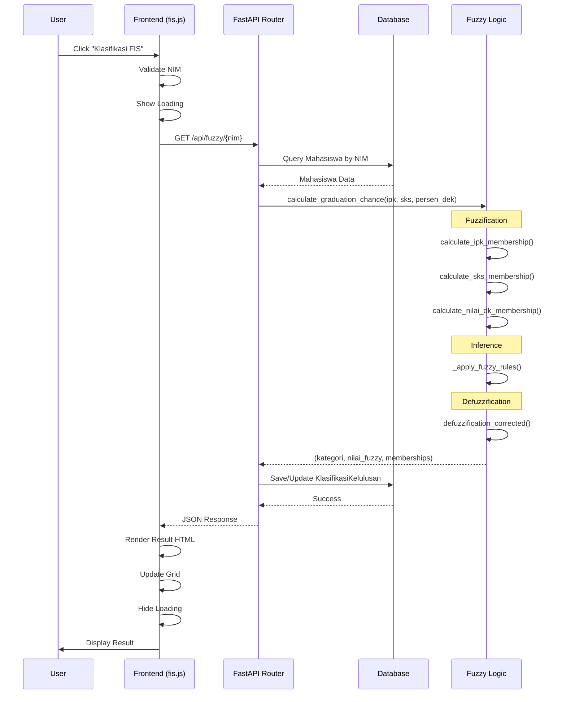

# Dokumentasi Alur Klasifikasi FIS (Fuzzy Inference System)

## 📋 Daftar Isi
1. [Overview](#overview)
2. [Diagram Alur Lengkap](#diagram-alur-lengkap)
3. [Detail Proses Frontend](#detail-proses-frontend)
4. [Detail Proses Backend](#detail-proses-backend)
5. [Function Reference](#function-reference)
6. [Contoh Request & Response](#contoh-request--response)

---

## Overview

Aplikasi ini menggunakan **Fuzzy Inference System (FIS)** untuk mengklasifikasikan peluang kelulusan mahasiswa berdasarkan 3 kriteria:
- **IPK** (Indeks Prestasi Kumulatif)
- **SKS** (Satuan Kredit Semester)
- **Persentase Nilai D/E/K** (Persentase nilai D, E, dan K)

Alur klasifikasi dimulai ketika user mengklik tombol "Klasifikasi FIS" di frontend, kemudian data dikirim ke backend melalui HTTP request, diproses menggunakan fuzzy logic, dan hasilnya dikembalikan ke frontend untuk ditampilkan.

---

## Diagram Alur Lengkap

```
┌─────────────────────────────────────────────────────────────────────────┐
│                           FRONTEND (Browser)                             │
└─────────────────────────────────────────────────────────────────────────┘
                                    │
                                    │ 1. User Click
                                    ▼
                    ┌───────────────────────────────┐
                    │  initializeButtons()          │
                    │  $("#btnKlasifikasi").click()  │
                    └───────────────┬───────────────┘
                                    │
                                    │ 2. Validasi NIM
                                    ▼
                    ┌───────────────────────────────┐
                    │  Validasi NIM dari dropdown   │
                    │  atau data-nim attribute      │
                    └───────────────┬───────────────┘
                                    │
                                    │ 3. Tampilkan Loading
                                    ▼
                    ┌───────────────────────────────┐
                    │  kendo.ui.progress()         │
                    │  Menampilkan loading indicator│
                    └───────────────┬───────────────┘
                                    │
                                    │ 4. HTTP GET Request
                                    ▼
┌─────────────────────────────────────────────────────────────────────────┐
│                    HTTP REQUEST (AJAX)                                   │
│  GET /api/fuzzy/{nim}                                                    │
│  Headers: Content-Type: application/json                                 │
└─────────────────────────────────────────────────────────────────────────┘
                                    │
                                    ▼
┌─────────────────────────────────────────────────────────────────────────┐
│                        BACKEND (FastAPI)                                 │
└─────────────────────────────────────────────────────────────────────────┘
                                    │
                                    │ 5. Router Handler
                                    ▼
                    ┌───────────────────────────────┐
                    │  @router.get("/{nim}")        │
                    │  get_fuzzy_result(nim, db)    │
                    └───────────────┬───────────────┘
                                    │
                                    │ 6. Query Database
                                    ▼
                    ┌───────────────────────────────┐
                    │  db.query(Mahasiswa)          │
                    │  .filter(Mahasiswa.nim == nim)│
                    │  .first()                     │
                    └───────────────┬───────────────┘
                                    │
                                    │ 7. Cek Data Mahasiswa
                                    ▼
                    ┌───────────────────────────────┐
                    │  Validasi mahasiswa exists     │
                    │  Ambil: ipk, sks, persen_dek   │
                    └───────────────┬───────────────┘
                                    │
                                    │ 8. Fuzzy Logic Processing
                                    ▼
                    ┌───────────────────────────────┐
                    │  fuzzy_system.calculate_       │
                    │  graduation_chance()           │
                    └───────────────┬───────────────┘
                                    │
                                    │ 9. Fuzzifikasi
                                    ▼
        ┌───────────────────────────────────────────┐
        │  calculate_ipk_membership(ipk)            │
        │  calculate_sks_membership(sks)             │
        │  calculate_nilai_dk_membership(persen_dek) │
        └───────────────────┬───────────────────────┘
                            │
                            │ 10. Inferensi Fuzzy
                            ▼
        ┌───────────────────────────────────────────┐
        │  _apply_fuzzy_rules()                     │
        │  - 20 fuzzy rules                         │
        │  - Min untuk rule strength                │
        │  - Max untuk output membership            │
        └───────────────────┬───────────────────────┘
                            │
                            │ 11. Defuzzifikasi
                            ▼
        ┌───────────────────────────────────────────┐
        │  defuzzification_corrected()              │
        │  - Weighted average                        │
        │  - Nilai crisp (0-100)                    │
        │  - Kategori: TINGGI/SEDANG/KECIL          │
        └───────────────────┬───────────────────────┘
                            │
                            │ 12. Save/Update Database
                            ▼
                    ┌───────────────────────────────┐
                    │  Cek existing klasifikasi     │
                    │  Update atau Insert baru       │
                    │  db.commit()                   │
                    └───────────────┬───────────────┘
                                    │
                                    │ 13. Format Response
                                    ▼
                    ┌───────────────────────────────┐
                    │  Return JSON Response         │
                    │  - nim, nama, program_studi    │
                    │  - kategori, nilai_fuzzy      │
                    │  - ipk_membership, etc.       │
                    └───────────────┬───────────────┘
                                    │
                                    │ 14. HTTP Response
                                    ▼
┌─────────────────────────────────────────────────────────────────────────┐
│                    HTTP RESPONSE (JSON)                                  │
│  Status: 200 OK                                                          │
│  Body: { nim, nama, kategori, nilai_fuzzy, ... }                        │
└─────────────────────────────────────────────────────────────────────────┘
                                    │
                                    ▼
┌─────────────────────────────────────────────────────────────────────────┐
│                           FRONTEND (Browser)                             │
└─────────────────────────────────────────────────────────────────────────┘
                                    │
                                    │ 15. Success Handler
                                    ▼
                    ┌───────────────────────────────┐
                    │  success: function(response)  │
                    │  - Render hasil ke HTML        │
                    │  - Update grid dengan data baru│
                    │  - Show notification           │
                    └───────────────┬───────────────┘
                                    │
                                    │ 16. Sembunyikan Loading
                                    ▼
                    ┌───────────────────────────────┐
                    │  complete: function()         │
                    │  kendo.ui.progress(false)     │
                    └───────────────────────────────┘
```

---

## Detail Proses Frontend

### 1. Inisialisasi Event Handler

**File:** `src/frontend/js/fis.js`

**Function:** `initializeButtons()`

```javascript
function initializeButtons() {
    // Event handler untuk tombol klasifikasi single
    $("#btnKlasifikasi").click(function() {
        var finalNim = $(this).attr('data-nim');
        // ... validasi dan proses klasifikasi
    });
}
```

**Lokasi:** Dipanggil saat halaman FIS dimuat (`initializeFISComponents()`)

### 2. User Click Handler

**Function:** `$("#btnKlasifikasi").click()`

**Proses:**
1. **Ambil NIM** dari attribute `data-nim` atau dropdown
2. **Validasi NIM** - pastikan tidak kosong
3. **Tampilkan loading** menggunakan `kendo.ui.progress()`
4. **Kirim HTTP Request** menggunakan jQuery AJAX

### 3. HTTP Request

**Method:** `GET`
**URL:** `${CONFIG.getApiUrl(CONFIG.ENDPOINTS.FUZZY)}/${finalNim}`
**Contoh:** `http://localhost:8000/api/fuzzy/18602241076`

**Code:**
```javascript
$.ajax({
    url: `${CONFIG.getApiUrl(CONFIG.ENDPOINTS.FUZZY)}/${finalNim}`,
    type: "GET",
    success: function(response) {
        // Handle success
    },
    error: function(xhr) {
        // Handle error
    },
    complete: function() {
        // Hide loading
    }
});
```

### 4. Success Handler

**Function:** `success: function(response)`

**Proses:**
1. **Render HTML** dengan hasil klasifikasi
2. **Update Grid** dengan data baru menggunakan `updateFISGridWithNewData()`
3. **Show Notification** sukses
4. **Display Result** di section `#hasilDetailFIS`

**Data yang ditampilkan:**
- Informasi Mahasiswa (NIM, Nama, Program Studi)
- Nilai Kriteria (IPK, SKS, Persen D/E/K) dengan membership values
- Hasil Klasifikasi (Nilai Fuzzy, Kategori)

### 5. Error Handler

**Function:** `error: function(xhr)`

**Proses:**
1. **Extract error message** dari `xhr.responseJSON.detail`
2. **Show notification** error
3. **Hide loading** indicator

---

## Detail Proses Backend

### 1. Router Endpoint

**File:** `src/backend/routers/fuzzy.py`

**Endpoint:** `@router.get("/{nim}")`

**Function:** `get_fuzzy_result(nim: str, db: Session = Depends(get_db))`

**Deklarasi:**
```python
@router.get("/{nim}")
def get_fuzzy_result(nim: str, db: Session = Depends(get_db)):
    """
    Mendapatkan hasil klasifikasi FIS untuk mahasiswa dengan NIM tertentu
    """
```

### 2. Query Database

**Proses:**
1. **Query Mahasiswa** berdasarkan NIM
2. **Validasi** mahasiswa exists
3. **Ambil data:** `ipk`, `sks`, `persen_dek`

**Code:**
```python
mahasiswa = db.query(Mahasiswa).filter(Mahasiswa.nim == nim).first()
if not mahasiswa:
    raise HTTPException(status_code=404, detail="Mahasiswa tidak ditemukan")
```

### 3. Fuzzy Logic Processing

**File:** `src/backend/fuzzy_logic.py`

**Class:** `FuzzyKelulusan`

**Function:** `calculate_graduation_chance(ipk, sks, persen_dek)`

**Proses:**

#### 3.1. Fuzzifikasi (Fuzzification)

**Input:** Nilai crisp (IPK, SKS, Persen D/E/K)
**Output:** Derajat keanggotaan (membership values)

**Functions:**
- `calculate_ipk_membership(ipk)` → `(rendah, sedang, tinggi)`
- `calculate_sks_membership(sks)` → `(sedikit, sedang, banyak)`
- `calculate_nilai_dk_membership(persen_dek)` → `(sedikit, sedang, banyak)`

**Membership Functions:**
- **Trapezoid (trapmf):** Untuk kategori rendah/tinggi
- **Triangle (trimf):** Untuk kategori sedang

**Contoh IPK Membership:**
```python
# IPK Rendah: trapmf [0.0, 2.0, 2.5, 3.0]
# IPK Sedang: trimf [2.8, 3.2, 3.6]
# IPK Tinggi: trapmf [3.4, 3.7, 4.0, 4.0]
```

#### 3.2. Inferensi Fuzzy (Fuzzy Inference)

**Function:** `_apply_fuzzy_rules(ipk_memberships, sks_memberships, nilai_dk_memberships)`

**Proses:**
1. **20 Fuzzy Rules** diterapkan
2. **Rule Strength** = `min(ipk_val, sks_val, nilai_val)`
3. **Output Membership** = `max()` dari semua rule strength untuk setiap kategori

**Contoh Rules:**
```python
# Rule 1: IF IPK Tinggi AND SKS Banyak AND DEK Sedikit THEN Peluang Tinggi
# Rule 2: IF IPK Sedang AND SKS Sedang AND DEK Sedang THEN Peluang Sedang
# Rule 3: IF IPK Rendah AND SKS Sedikit AND DEK Banyak THEN Peluang Kecil
# ... (total 20 rules)
```

**Output:** `(peluang_kecil, peluang_sedang, peluang_tinggi)`

#### 3.3. Defuzzifikasi (Defuzzification)

**Function:** `defuzzification_corrected(peluang_memberships)`

**Method:** Weighted Average

**Formula:**
```
numerator = (peluang_kecil * 20.0 + 
             peluang_sedang * 50.0 + 
             peluang_tinggi * 83.87)
denominator = peluang_kecil + peluang_sedang + peluang_tinggi
nilai_crisp = numerator / denominator
```

**Crisp Output Values:**
- Kecil: `20.0`
- Sedang: `50.0`
- Tinggi: `83.87`

**Kategori berdasarkan nilai_crisp:**
- `nilai_crisp >= 60` → **Peluang Lulus Tinggi**
- `40 <= nilai_crisp < 60` → **Peluang Lulus Sedang**
- `nilai_crisp < 40` → **Peluang Lulus Kecil**

### 4. Save to Database

**Proses:**
1. **Cek existing** klasifikasi untuk NIM tersebut
2. **Update** jika sudah ada, atau **Insert** jika baru
3. **Commit** perubahan ke database

**Code:**
```python
existing = db.query(KlasifikasiKelulusan).filter(
    KlasifikasiKelulusan.nim == nim
).first()

if existing:
    # Update
    existing.nilai_fuzzy = nilai_fuzzy
    existing.kategori = kategori
    # ...
else:
    # Insert
    new_klasifikasi = KlasifikasiKelulusan(...)
    db.add(new_klasifikasi)

db.commit()
```

### 5. Format Response

**Response Structure:**
```python
{
    "nim": "18602241076",
    "nama": "Nama Mahasiswa",
    "program_studi": "Program Studi",
    "ipk": 3.4,
    "sks": 150,
    "persen_dek": 0.0,
    "kategori": "Peluang Lulus Tinggi",
    "nilai_fuzzy": 83.87,
    "ipk_membership": 0.5,
    "sks_membership": 0.5,
    "nilai_dk_membership": 1.0
}
```

---

## Function Reference

### Frontend Functions

#### `initializeButtons()`
**File:** `src/frontend/js/fis.js:567`
**Deskripsi:** Inisialisasi event handler untuk tombol klasifikasi
**Dependencies:** jQuery, Kendo UI

#### `$("#btnKlasifikasi").click()`
**File:** `src/frontend/js/fis.js:571`
**Deskripsi:** Handler ketika tombol klasifikasi diklik
**Proses:**
- Validasi NIM
- Tampilkan loading
- Kirim AJAX request
- Handle response

#### `updateFISGridWithNewData(response)`
**File:** `src/frontend/js/fis.js:670`
**Deskripsi:** Update grid dengan data klasifikasi baru
**Parameter:** `response` - JSON response dari API

#### `getFISClassificationColor(kategori)`
**File:** `src/frontend/js/fis.js:596`
**Deskripsi:** Mendapatkan warna berdasarkan kategori
**Return:** Hex color code

#### `getFISClassificationThreshold(kategori)`
**File:** `src/frontend/js/fis.js:661`
**Deskripsi:** Mendapatkan threshold text untuk kategori
**Return:** String threshold

### Backend Functions

#### `get_fuzzy_result(nim, db)`
**File:** `src/backend/routers/fuzzy.py:307`
**Deskripsi:** Router handler untuk GET request klasifikasi FIS
**Parameter:**
- `nim: str` - Nomor Induk Mahasiswa
- `db: Session` - Database session
**Return:** JSON response dengan hasil klasifikasi

#### `calculate_graduation_chance(ipk, sks, persen_dek)`
**File:** `src/backend/fuzzy_logic.py:236`
**Deskripsi:** Fungsi utama untuk menghitung peluang kelulusan
**Parameter:**
- `ipk: float` - Indeks Prestasi Kumulatif
- `sks: int` - Satuan Kredit Semester
- `persen_dek: float` - Persentase nilai D/E/K
**Return:** `(kategori, nilai_crisp, max_ipk, max_sks, max_dek)`

#### `calculate_ipk_membership(ipk)`
**File:** `src/backend/fuzzy_logic.py:94`
**Deskripsi:** Menghitung derajat keanggotaan IPK
**Return:** `(rendah, sedang, tinggi)` - Tuple of membership values

#### `calculate_sks_membership(sks)`
**File:** `src/backend/fuzzy_logic.py:109`
**Deskripsi:** Menghitung derajat keanggotaan SKS
**Return:** `(sedikit, sedang, banyak)` - Tuple of membership values

#### `calculate_nilai_dk_membership(persen_dek)`
**File:** `src/backend/fuzzy_logic.py:124`
**Deskripsi:** Menghitung derajat keanggotaan persentase D/E/K
**Return:** `(sedikit, sedang, banyak)` - Tuple of membership values

#### `_apply_fuzzy_rules(ipk_memberships, sks_memberships, nilai_dk_memberships)`
**File:** `src/backend/fuzzy_logic.py:139`
**Deskripsi:** Menerapkan 20 fuzzy rules untuk inferensi
**Return:** `(peluang_kecil, peluang_sedang, peluang_tinggi)`

#### `defuzzification_corrected(peluang_memberships)`
**File:** `src/backend/fuzzy_logic.py:192`
**Deskripsi:** Melakukan defuzzifikasi menggunakan weighted average
**Return:** `(nilai_crisp, kategori)`

#### `_calculate_membership_triangle(x, a, b, c)`
**File:** `src/backend/fuzzy_logic.py:42`
**Deskripsi:** Menghitung membership value untuk fungsi segitiga
**Formula:** 
- `x <= a or x >= c` → 0
- `x == b` → 1
- `a < x < b` → `(x - a) / (b - a)`
- `b < x < c` → `(c - x) / (c - b)`

#### `_calculate_membership_trapezoid(x, a, b, c, d)`
**File:** `src/backend/fuzzy_logic.py:56`
**Deskripsi:** Menghitung membership value untuk fungsi trapesium
**Formula:**
- `x < a or x > d` → 0
- `b <= x <= c` → 1
- `a <= x < b` → `(x - a) / (b - a)`
- `c < x < d` → `(d - x) / (d - c)`

---

## Contoh Request & Response

### Request

**Method:** `GET`
**URL:** `http://localhost:8000/api/fuzzy/18602241076`
**Headers:**
```
Content-Type: application/json
```

**No Body** (GET request)

### Response Success (200 OK)

```json
{
    "nim": "18602241076",
    "nama": "John Doe",
    "program_studi": "Teknik Informatika",
    "ipk": 3.4,
    "sks": 150,
    "persen_dek": 0.0,
    "kategori": "Peluang Lulus Tinggi",
    "nilai_fuzzy": 83.87,
    "ipk_membership": 0.5,
    "sks_membership": 0.5,
    "nilai_dk_membership": 1.0
}
```

### Response Error (404 Not Found)

```json
{
    "detail": "Mahasiswa tidak ditemukan"
}
```

### Response Error (500 Internal Server Error)

```json
{
    "detail": "Terjadi kesalahan saat melakukan klasifikasi: [error message]"
}
```

---

## Diagram Sequence



---

## Teknologi yang Digunakan

### Frontend
- **jQuery** - DOM manipulation dan AJAX
- **Kendo UI** - UI components (Grid, Progress, ComboBox)
- **JavaScript (ES6+)** - Logic dan event handling

### Backend
- **FastAPI** - Web framework
- **SQLAlchemy** - ORM untuk database
- **Python 3.x** - Programming language
- **Fuzzy Logic** - Custom implementation

### Database
- **PostgreSQL** - Relational database
- **Tables:**
  - `mahasiswa` - Data mahasiswa
  - `klasifikasi_kelulusan` - Hasil klasifikasi

---

## Catatan Penting

1. **NIM Validation:** Frontend memvalidasi NIM sebelum mengirim request
2. **Error Handling:** Backend mengembalikan HTTP status code yang sesuai (404, 500, dll)
3. **Database Transaction:** Setiap klasifikasi disimpan ke database untuk tracking
4. **Caching:** Frontend menggunakan cache untuk mengurangi request ke server
5. **Loading Indicator:** User feedback diberikan melalui Kendo UI progress indicator

---

## Troubleshooting

### Masalah: NIM tidak ditemukan
**Solusi:** Pastikan NIM valid dan ada di database

### Masalah: Response error 500
**Solusi:** Cek log backend untuk detail error, pastikan database connection OK

### Masalah: Loading tidak hilang
**Solusi:** Pastikan `complete` handler dipanggil di AJAX request

### Masalah: Hasil tidak muncul
**Solusi:** Cek console browser untuk error JavaScript, pastikan response format sesuai

---

**Dokumentasi ini dibuat untuk membantu developer memahami alur klasifikasi FIS dari frontend hingga backend.**

