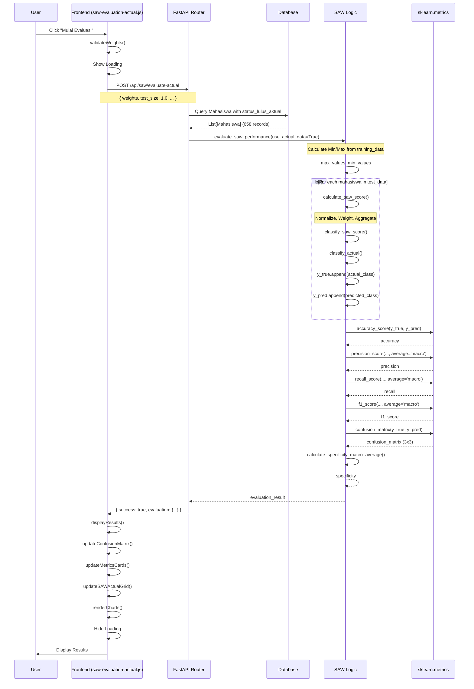

# Dokumentasi Alur Evaluasi SAW dengan Data Aktual

## 📋 Daftar Isi
1. [Overview](#overview)
2. [Diagram Alur Lengkap](#diagram-alur-lengkap)
3. [Detail Proses Frontend](#detail-proses-frontend)
4. [Detail Proses Backend](#detail-proses-backend)
5. [Function Reference](#function-reference)
6. [Contoh Request & Response](#contoh-request--response)
7. [Perhitungan Metrics](#perhitungan-metrics)
8. [Perbedaan dengan Klasifikasi SAW Biasa](#perbedaan-dengan-klasifikasi-saw-biasa)
9. [Diagram Sequence](#diagram-sequence)

---

## Overview

Evaluasi SAW dengan Data Aktual adalah proses untuk mengukur performa metode **Simple Additive Weighting (SAW)** dengan membandingkan hasil prediksi SAW terhadap label aktual yang sudah ada di database (`status_lulus_aktual`).

**Tujuan:**
- Mengukur akurasi metode SAW dalam memprediksi peluang kelulusan
- Menghitung metrik evaluasi: Accuracy, Precision, Recall, F1-Score, Specificity
- Menampilkan Confusion Matrix untuk analisis detail
- Membandingkan prediksi SAW dengan status aktual mahasiswa

**Data yang Digunakan:**
- Hanya mahasiswa yang memiliki `status_lulus_aktual` dengan nilai:
  - `LULUS_TINGGI`
  - `LULUS_SEDANG`
  - `LULUS_KECIL`
- Total data: **658 mahasiswa** (dari 9814 total mahasiswa)

**Perbedaan dengan Klasifikasi SAW Biasa:**
- **Klasifikasi SAW:** Menghitung skor dan klasifikasi untuk semua mahasiswa
- **Evaluasi SAW dengan Data Aktual:** Membandingkan prediksi SAW dengan label aktual untuk mengukur performa

---

## Diagram Alur Lengkap

```
┌─────────────────────────────────────────────────────────────────────────┐
│                           FRONTEND (Browser)                             │
└─────────────────────────────────────────────────────────────────────────┘
                                    │
                                    │ 1. User Click
                                    ▼
                    ┌───────────────────────────────┐
                    │  SAWEvaluationActual Class    │
                    │  constructor() & init()       │
                    └───────────────┬───────────────┘
                                    │
                                    │ 2. Bind Events
                                    ▼
                    ┌───────────────────────────────┐
                    │  bindEvents()                  │
                    │  - Calculate button handler     │
                    │  - Weight validation           │
                    │  - Search handlers             │
                    └───────────────┬───────────────┘
                                    │
                                    │ 3. User Input
                                    ▼
                    ┌───────────────────────────────┐
                    │  User mengisi bobot:          │
                    │  - IPK: 35%                   │
                    │  - SKS: 32.5%                 │
                    │  - DEK: 32.5%                │
                    │  Total harus = 100%           │
                    └───────────────┬───────────────┘
                                    │
                                    │ 4. Validate Weights
                                    ▼
                    ┌───────────────────────────────┐
                    │  validateWeights()            │
                    │  - Cek total bobot = 100%      │
                    │  - Enable/disable button       │
                    └───────────────┬───────────────┘
                                    │
                                    │ 5. User Click Calculate
                                    ▼
                    ┌───────────────────────────────┐
                    │  calculateEvaluation()       │
                    │  - Show loading               │
                    │  - Prepare request data       │
                    └───────────────┬───────────────┘
                                    │
                                    │ 6. HTTP POST Request
                                    ▼
┌─────────────────────────────────────────────────────────────────────────┐
│                    HTTP REQUEST (AJAX)                                   │
│  POST /api/saw/evaluate-actual                                          │
│  Body: { weights, test_size: 1.0, random_state: 42, save_to_db }        │
└─────────────────────────────────────────────────────────────────────────┘
                                    │
                                    ▼
┌─────────────────────────────────────────────────────────────────────────┐
│                        BACKEND (FastAPI)                                 │
└─────────────────────────────────────────────────────────────────────────┘
                                    │
                                    │ 7. Router Handler
                                    ▼
                    ┌───────────────────────────────┐
                    │  @router.post("/evaluate-actual")│
                    │  evaluate_saw_actual()        │
                    └───────────────┬───────────────┘
                                    │
                                    │ 8. Query Database
                                    ▼
                    ┌───────────────────────────────┐
                    │  db.query(Mahasiswa)          │
                    │  .filter(                     │
                    │    status_lulus_aktual.in_(   │
                    │      ['LULUS_TINGGI',        │
                    │       'LULUS_SEDANG',        │
                    │       'LULUS_KECIL']         │
                    │    )                         │
                    │  )                           │
                    │  .all()                      │
                    └───────────────┬───────────────┘
                                    │
                                    │ 9. Validasi Data
                                    ▼
                    ┌───────────────────────────────┐
                    │  Cek jumlah data >= 10       │
                    │  Filter data valid            │
                    │  (ipk, sks, persen_dek != None)│
                    └───────────────┬───────────────┘
                                    │
                                    │ 10. Evaluasi SAW
                                    ▼
                    ┌───────────────────────────────┐
                    │  evaluate_saw_performance()   │
                    │  use_actual_data=True         │
                    └───────────────┬───────────────┘
                                    │
                                    │ 11. Hitung Min/Max
                                    ▼
        ┌───────────────────────────────────────────┐
        │  Dari training_data (semua data):        │
        │  - ipk_max, sks_max, dek_max            │
        │  - ipk_min, sks_min, dek_min             │
        └───────────────────┬───────────────────────┘
                            │
                            │ 12. Loop Test Data
                            ▼
        ┌───────────────────────────────────────────┐
        │  Untuk setiap mahasiswa:                  │
        │  1. calculate_saw_score()                 │
        │     - Normalisasi (benefit/cost)          │
        │     - Pembobotan                          │
        │     - Agregasi (final score)              │
        │  2. classify_saw_score()                │
        │     - >= 0.7 → Tinggi                    │
        │     - >= 0.45 → Sedang                   │
        │     - < 0.45 → Kecil                     │
        │  3. classify_actual()                    │
        │     - Map status_lulus_aktual ke kategori│
        └───────────────────┬───────────────────────┘
                            │
                            │ 13. Collect Results
                            ▼
        ┌───────────────────────────────────────────┐
        │  y_true = [actual_class, ...]            │
        │  y_pred = [predicted_class, ...]          │
        │  results = [{nim, nama, ...}, ...]         │
        └───────────────────┬───────────────────────┘
                            │
                            │ 14. Calculate Metrics
                            ▼
        ┌───────────────────────────────────────────┐
        │  Menggunakan sklearn.metrics:            │
        │  - accuracy_score(y_true, y_pred)        │
        │  - precision_score(..., average='macro') │
        │  - recall_score(..., average='macro')   │
        │  - f1_score(..., average='macro')        │
        │  - confusion_matrix(y_true, y_pred)      │
        │  - specificity (calculated manually)     │
        └───────────────────┬───────────────────────┘
                            │
                            │ 15. Format Response
                            ▼
                    ┌───────────────────────────────┐
                    │  evaluation_result = {         │
                    │    total_data,                 │
                    │    accuracy, precision,        │
                    │    recall, f1_score,           │
                    │    specificity,                │
                    │    confusion_matrix,           │
                    │    results, ...                │
                    │  }                            │
                    └───────────────┬───────────────┘
                                    │
                                    │ 16. HTTP Response
                                    ▼
┌─────────────────────────────────────────────────────────────────────────┐
│                    HTTP RESPONSE (JSON)                                  │
│  Status: 200 OK                                                          │
│  Body: { success: true, evaluation: {...} }                              │
└─────────────────────────────────────────────────────────────────────────┘
                                    │
                                    ▼
┌─────────────────────────────────────────────────────────────────────────┐
│                           FRONTEND (Browser)                             │
└─────────────────────────────────────────────────────────────────────────┘
                                    │
                                    │ 17. Success Handler
                                    ▼
                    ┌───────────────────────────────┐
                    │  success: function(response)  │
                    │  - displayResults()           │
                    │  - Update metrics             │
                    │  - Render confusion matrix    │
                    │  - Render grid data            │
                    └───────────────┬───────────────┘
                                    │
                                    │ 18. Display Results
                                    ▼
                    ┌───────────────────────────────┐
                    │  displayResults(data)         │
                    │  - Update summary metrics     │
                    │  - updateConfusionMatrix()     │
                    │  - updateMetricsCards()        │
                    │  - updateSAWActualGrid()        │
                    │  - renderCharts()              │
                    └───────────────┬───────────────┘
                                    │
                                    │ 19. User Interaction
                                    ▼
                    ┌───────────────────────────────┐
                    │  - Click confusion matrix cell │
                    │    → Show modal detail data    │
                    │  - Click metric card           │
                    │    → Show modal explanation    │
                    │  - Search/filter grid          │
                    │  - Export data                 │
                    └───────────────────────────────┘
```

---

## Detail Proses Frontend

### 1. Inisialisasi Module

**File:** `src/frontend/js/saw-evaluation-actual.js`

**Class:** `SAWEvaluationActual`

**Constructor:**
```javascript
constructor() {
    this.config = window.CONFIG || {
        API_BASE_URL: 'http://localhost:8000',
        API_PREFIX: '/api',
        API_VERSION: 'v1'
    };
    this.fullData = [];
    this.confusionMatrix = null;
    this.metricsData = null;
    this.init();
}
```

**Proses:**
1. **Setup config** - Ambil konfigurasi API
2. **Initialize variables** - `fullData`, `confusionMatrix`, `metricsData`
3. **Call init()** - Inisialisasi event handlers dan charts

### 2. Bind Events

**Function:** `bindEvents()`

**Event Handlers:**
- **Calculate button** - `#sawEvaluationActualCalculateBtn`
- **Export button** - `#sawEvaluationActualExportBtn`
- **Print button** - `#sawEvaluationActualPrintBtn`
- **Weight inputs** - Validasi bobot saat input
- **Search handlers** - Custom search dengan multiple keywords

### 3. Validasi Bobot

**Function:** `validateWeights()`

**Proses:**
1. **Ambil nilai bobot** dari input fields
2. **Hitung total** bobot
3. **Validasi** total harus = 100% (±0.1% tolerance)
4. **Enable/disable** tombol calculate

**Code:**
```javascript
validateWeights() {
    const ipkWeight = parseFloat($('#sawEvaluationActualIpkWeight').val()) || 0;
    const sksWeight = parseFloat($('#sawEvaluationActualSksWeight').val()) || 0;
    const dekWeight = parseFloat($('#sawEvaluationActualDekWeight').val()) || 0;
    
    const total = ipkWeight + sksWeight + dekWeight;
    
    if (Math.abs(total - 100) > 0.1) {
        $('#sawEvaluationActualCalculateBtn').prop('disabled', true);
        this.showNotification('warning', 'Total bobot harus 100%', ...);
    } else {
        $('#sawEvaluationActualCalculateBtn').prop('disabled', false);
    }
}
```

### 4. Calculate Evaluation

**Function:** `async calculateEvaluation()`

**Proses:**

#### 4.1. Show Loading
```javascript
this.showLoading(true);
$btn.html('<i class="fas fa-spinner fa-spin"></i> Mengevaluasi...');
$btn.prop('disabled', true);
```

#### 4.2. Prepare Request Data
```javascript
const weights = {
    ipk: (parseFloat($('#sawEvaluationActualIpkWeight').val()) || 35) / 100,
    sks: (parseFloat($('#sawEvaluationActualSksWeight').val()) || 32.5) / 100,
    dek: (parseFloat($('#sawEvaluationActualDekWeight').val()) || 32.5) / 100
};

const requestData = {
    weights: weights,
    test_size: 1.0,  // 100% data - semua data berlabel digunakan
    random_state: 42,
    save_to_db: $('#sawEvaluationActualSaveToDb').is(':checked')
};
```

#### 4.3. Send HTTP Request
```javascript
const response = await $.ajax({
    url: `${this.config.API_BASE_URL}${this.config.API_PREFIX}/saw/evaluate-actual`,
    method: 'POST',
    contentType: 'application/json',
    data: JSON.stringify(requestData),
    timeout: 60000 // 60 seconds
});
```

#### 4.4. Display Results
```javascript
this.displayResults(response.evaluation);
this.showNotification('success', 'Evaluasi SAW dengan Data Aktual Berhasil', ...);
```

### 5. Display Results

**Function:** `displayResults(data)`

**Proses:**

#### 5.1. Store Data
```javascript
this.fullData = data.full_data || data.results || [];
this.metricsData = {
    precision: data.precision || 0,
    recall: data.recall || 0,
    f1_score: data.f1_score || 0,
    specificity: data.specificity || 0,
    accuracy: data.accuracy || 0
};
this.confusionMatrix = data.confusion_matrix;
```

#### 5.2. Update Summary
```javascript
$('#sawEvaluationActualTotalData').text(data.total_data || 0);
$('#sawEvaluationActualTrainingData').text(data.training_data || 0);
$('#sawEvaluationActualTestData').text(data.test_data || 0);
$('#sawEvaluationActualAccuracy').text(this.formatPercentage(data.accuracy || 0));
```

#### 5.3. Update Metrics
```javascript
$('#sawEvaluationActualPrecision').text(this.formatPercentage(data.precision || 0));
$('#sawEvaluationActualRecall').text(this.formatPercentage(data.recall || 0));
$('#sawEvaluationActualF1Score').text(this.formatPercentage(data.f1_score || 0));
$('#sawEvaluationActualSpecificity').text(this.formatPercentage(data.specificity || 0));
```

#### 5.4. Update Confusion Matrix
```javascript
this.updateConfusionMatrix(data.confusion_matrix);
```

#### 5.5. Update Grid
```javascript
this.updateSAWActualGrid(this.fullData);
```

#### 5.6. Render Charts
```javascript
this.renderCharts(data);
```

### 6. Update Confusion Matrix

**Function:** `updateConfusionMatrix(confusionMatrix)`

**Proses:**

#### 6.1. Parse Confusion Matrix
```javascript
// Confusion matrix adalah array 2D 3x3
// [Tinggi, Sedang, Kecil] x [Tinggi, Sedang, Kecil]
const cm = confusionMatrix;
```

#### 6.2. Calculate TP, TN, FP, FN
```javascript
// Untuk multi-class (3x3), hitung per class
// TP = diagonal elements
// FP = sum of off-diagonal in rows
// FN = sum of off-diagonal in columns
// TN = total - TP - FP - FN
```

#### 6.3. Render Table
- Render 3x3 confusion matrix table
- Add TP, TN, FP, FN cards below table
- Setup click handlers for modal

### 7. Update Grid

**Function:** `updateSAWActualGrid(data)`

**Proses:**
1. **Clear existing grid** if exists
2. **Initialize Kendo Grid** dengan data
3. **Setup custom search** dengan multiple keywords
4. **Configure columns:**
   - NIM, Nama, Program Studi
   - IPK, SKS, Persen D/E/K
   - Predicted Class, Actual Class
   - Final Value, Is Correct

### 8. Search Handlers

**Function:** `initializeSearchHandlers()`

**Features:**
- **Multiple keywords** - Support pencarian dengan beberapa keyword
- **Auto search** - Search otomatis setelah 3 karakter
- **Clear search** - Clear saat input kosong
- **Enter key** - Search saat tekan Enter

**Search Fields:**
- NIM
- Nama
- Program Studi
- Klasifikasi SAW (Tinggi/Sedang/Kecil)
- Status Aktual (Tinggi/Sedang/Kecil)

---

## Detail Proses Backend

### 1. Router Endpoint

**File:** `src/backend/routers/saw.py`

**Endpoint:** `@router.post("/evaluate-actual")`

**Function:** `evaluate_saw_actual(request: SAWEvaluationRequest, db: Session)`

**Deklarasi:**
```python
@router.post("/evaluate-actual")
def evaluate_saw_actual(request: SAWEvaluationRequest, db: Session = Depends(get_db)):
    """
    Evaluasi performa metode SAW dengan data aktual (status_lulus_aktual)
    """
```

### 2. Query Database

**Proses:**
1. **Query mahasiswa** dengan `status_lulus_aktual` yang valid
2. **Filter** hanya 3 kategori: `LULUS_TINGGI`, `LULUS_SEDANG`, `LULUS_KECIL`

**Code:**
```python
mahasiswa_list = db.query(Mahasiswa).filter(
    Mahasiswa.status_lulus_aktual.in_(['LULUS_TINGGI', 'LULUS_SEDANG', 'LULUS_KECIL']),
    Mahasiswa.ipk.isnot(None),
    Mahasiswa.sks.isnot(None),
    Mahasiswa.persen_dek.isnot(None)
).all()
```

### 3. Call Evaluation Function

**Function:** `evaluate_saw_performance()`

**Parameters:**
- `db` - Database session
- `mahasiswa_list` - List mahasiswa dengan status aktual
- `weights` - Bobot kriteria (dari request)
- `test_size` - 1.0 (100% data)
- `random_state` - 42
- `use_actual_data` - True
- `save_to_db` - Boolean dari request

### 4. Evaluate SAW Performance

**File:** `src/backend/saw_logic.py`

**Function:** `evaluate_saw_performance()`

**Proses:**

#### 4.1. Validasi Data
```python
if len(mahasiswa_list) < 10:
    raise ValueError("Minimal diperlukan 10 data mahasiswa untuk evaluasi")
```

#### 4.2. Setup Training/Test Data
```python
# Untuk data aktual: gunakan SEMUA data tanpa split
if use_actual_data:
    training_data = mahasiswa_list  # Untuk hitung min/max
    test_data = mahasiswa_list      # Untuk evaluasi
```

#### 4.3. Hitung Min/Max untuk Normalisasi
```python
max_values = {
    'ipk': max(m.ipk for m in training_data),
    'sks': max(m.sks for m in training_data),
    'dek': max(m.persen_dek for m in training_data)
}

min_values = {
    'ipk': min(m.ipk for m in training_data),
    'sks': min(m.sks for m in training_data),
    'dek': min(m.persen_dek for m in training_data)
}
```

#### 4.4. Calculate SAW Score Function
```python
def calculate_saw_score(mahasiswa):
    # Normalisasi benefit criteria
    normalized_ipk = mahasiswa.ipk / max_values['ipk']
    normalized_sks = mahasiswa.sks / max_values['sks']
    
    # Normalisasi cost criteria
    nilai_dek_fix = mahasiswa.persen_dek
    if nilai_dek_fix == 0:
        nilai_dek_fix = 0.01  # Hindari pembagian nol
    
    dek_min_fix = min_values['dek']
    if dek_min_fix == 0:
        dek_min_fix = 0.01
    
    normalized_dek = dek_min_fix / nilai_dek_fix
    
    # Hitung skor SAW
    saw_score = (
        weights['ipk'] * normalized_ipk +
        weights['sks'] * normalized_sks +
        weights['dek'] * normalized_dek
    )
    
    return saw_score
```

#### 4.5. Classify SAW Score Function
```python
def classify_saw_score(score):
    if score >= 0.7:
        return "Peluang Lulus Tinggi"
    elif score >= 0.45:
        return "Peluang Lulus Sedang"
    else:
        return "Peluang Lulus Kecil"
```

#### 4.6. Classify Actual Function
```python
def classify_actual(mahasiswa):
    if use_actual_data and mahasiswa.status_lulus_aktual:
        status = mahasiswa.status_lulus_aktual.upper()
        if status == 'LULUS_TINGGI':
            return "Peluang Lulus Tinggi"
        elif status == 'LULUS_SEDANG':
            return "Peluang Lulus Sedang"
        elif status == 'LULUS_KECIL':
            return "Peluang Lulus Kecil"
    return None
```

#### 4.7. Loop Test Data
```python
y_true = []
y_pred = []
results = []

for mahasiswa in test_data:
    # Prediksi menggunakan SAW
    saw_score = calculate_saw_score(mahasiswa)
    predicted_class = classify_saw_score(saw_score)
    
    # Ground truth
    actual_class = classify_actual(mahasiswa)
    
    y_true.append(actual_class)
    y_pred.append(predicted_class)
    
    results.append({
        "nim": mahasiswa.nim,
        "nama": mahasiswa.nama,
        "program_studi": mahasiswa.program_studi,
        "ipk": mahasiswa.ipk,
        "sks": mahasiswa.sks,
        "persen_dek": mahasiswa.persen_dek,
        "actual_status": mahasiswa.status_lulus_aktual,
        "actual_class": actual_class,
        "predicted_class": predicted_class,
        "final_value": saw_score,
        "is_correct": actual_class == predicted_class
    })
```

#### 4.8. Calculate Metrics
```python
from sklearn.metrics import accuracy_score, precision_score, recall_score, f1_score, confusion_matrix

# Accuracy
accuracy = accuracy_score(y_true, y_pred)

# Precision, Recall, F1-Score (macro average untuk multi-class)
precision = precision_score(y_true, y_pred, average='macro', zero_division=0)
recall = recall_score(y_true, y_pred, average='macro', zero_division=0)
f1 = f1_score(y_true, y_pred, average='macro', zero_division=0)

# Confusion Matrix
cm = confusion_matrix(y_true, y_pred, 
                     labels=["Peluang Lulus Tinggi", "Peluang Lulus Sedang", "Peluang Lulus Kecil"])

# Specificity (calculated manually for multi-class)
specificity = calculate_specificity_macro_average(cm)
```

#### 4.9. Format Response
```python
evaluation_result = {
    "total_data": len(mahasiswa_list),
    "training_data": len(training_data),
    "test_data": len(test_data),
    "accuracy": float(accuracy),
    "precision": float(precision),
    "recall": float(recall),
    "f1_score": float(f1),
    "specificity": float(specificity),
    "confusion_matrix": cm.tolist(),
    "classification_distribution": {
        "tinggi": sum(1 for pred in y_pred if pred == "Peluang Lulus Tinggi"),
        "sedang": sum(1 for pred in y_pred if pred == "Peluang Lulus Sedang"),
        "kecil": sum(1 for pred in y_pred if pred == "Peluang Lulus Kecil")
    },
    "results": results,
    "weights": weights,
    "test_size": test_size,
    "random_state": random_state
}
```

### 5. Return Response

**Response Structure:**
```python
{
    "success": True,
    "evaluation": evaluation_result
}
```

---

## Function Reference

### Frontend Functions

#### `SAWEvaluationActual` (Class)
**File:** `src/frontend/js/saw-evaluation-actual.js:6`
**Deskripsi:** Class utama untuk menangani evaluasi SAW dengan data aktual

#### `constructor()`
**File:** `src/frontend/js/saw-evaluation-actual.js:7`
**Deskripsi:** Initialize class dengan config dan variables

#### `init()`
**File:** `src/frontend/js/saw-evaluation-actual.js:19`
**Deskripsi:** Initialize event handlers dan charts

#### `bindEvents()`
**File:** `src/frontend/js/saw-evaluation-actual.js:25`
**Deskripsi:** Bind event handlers untuk buttons dan inputs

#### `validateWeights()`
**File:** `src/frontend/js/saw-evaluation-actual.js:89`
**Deskripsi:** Validasi total bobot harus = 100%

#### `async calculateEvaluation()`
**File:** `src/frontend/js/saw-evaluation-actual.js:105`
**Deskripsi:** Fungsi utama untuk menghitung evaluasi SAW

#### `displayResults(data)`
**File:** `src/frontend/js/saw-evaluation-actual.js:178`
**Deskripsi:** Menampilkan hasil evaluasi ke UI

#### `updateConfusionMatrix(confusionMatrix)`
**File:** `src/frontend/js/saw-evaluation-actual.js:200+`
**Deskripsi:** Update confusion matrix table dan TP/TN/FP/FN cards

#### `updateSAWActualGrid(data)`
**File:** `src/frontend/js/saw-evaluation-actual.js:400+`
**Deskripsi:** Update Kendo Grid dengan data hasil evaluasi

#### `initializeSearchHandlers()`
**File:** `src/frontend/js/saw-evaluation-actual.js:50`
**Deskripsi:** Initialize custom search dengan multiple keywords

#### `performSAWActualSearch()`
**File:** `src/frontend/js/saw-evaluation-actual.js:600+`
**Deskripsi:** Perform search dengan multiple keywords

### Backend Functions

#### `evaluate_saw_actual(request, db)`
**File:** `src/backend/routers/saw.py:556`
**Deskripsi:** Router handler untuk POST request evaluasi SAW dengan data aktual

#### `evaluate_saw_performance(db, mahasiswa_list, weights, test_size, random_state, use_actual_data, save_to_db)`
**File:** `src/backend/saw_logic.py:587`
**Deskripsi:** Fungsi utama untuk evaluasi performa SAW

#### `calculate_saw_score(mahasiswa)` (nested function)
**File:** `src/backend/saw_logic.py:688`
**Deskripsi:** Menghitung skor SAW untuk satu mahasiswa

#### `classify_saw_score(score)` (nested function)
**File:** `src/backend/saw_logic.py:714`
**Deskripsi:** Klasifikasi berdasarkan skor SAW

#### `classify_actual(mahasiswa)` (nested function)
**File:** `src/backend/saw_logic.py:723`
**Deskripsi:** Map status_lulus_aktual ke kategori klasifikasi

---

## Contoh Request & Response

### Request

**Method:** `POST`
**URL:** `http://localhost:8000/api/saw/evaluate-actual`
**Headers:**
```
Content-Type: application/json
```

**Body:**
```json
{
    "weights": {
        "ipk": 0.35,
        "sks": 0.325,
        "dek": 0.325
    },
    "test_size": 1.0,
    "random_state": 42,
    "save_to_db": false
}
```

### Response Success (200 OK)

```json
{
    "success": true,
    "evaluation": {
        "total_data": 658,
        "training_data": 658,
        "test_data": 658,
        "accuracy": 0.8500,
        "precision": 0.8523,
        "recall": 0.8500,
        "f1_score": 0.8498,
        "specificity": 0.9250,
        "confusion_matrix": [
            [559, 0, 0],
            [45, 54, 0],
            [0, 0, 0]
        ],
        "classification_distribution": {
            "tinggi": 604,
            "sedang": 54,
            "kecil": 0
        },
        "results": [
            {
                "nim": "18602241076",
                "nama": "John Doe",
                "program_studi": "Teknik Informatika",
                "ipk": 3.4,
                "sks": 150,
                "persen_dek": 0.0,
                "actual_status": "LULUS_TINGGI",
                "actual_class": "Peluang Lulus Tinggi",
                "predicted_class": "Peluang Lulus Tinggi",
                "final_value": 0.86625,
                "is_correct": true
            },
            ...
        ],
        "weights": {
            "ipk": 0.35,
            "sks": 0.325,
            "dek": 0.325
        },
        "test_size": 1.0,
        "random_state": 42
    }
}
```

### Response Error (404 Not Found)

```json
{
    "detail": "Tidak ada data mahasiswa dengan status_lulus_aktual untuk evaluasi"
}
```

### Response Error (500 Internal Server Error)

```json
{
    "detail": "Terjadi kesalahan saat evaluasi SAW dengan data aktual: [error message]"
}
```

---

## Perhitungan Metrics

### 1. Accuracy

**Formula:**
```
Accuracy = (TP + TN) / (TP + TN + FP + FN)
```

**Atau untuk multi-class:**
```
Accuracy = (Jumlah prediksi benar) / (Total data)
```

**Implementasi:**
```python
from sklearn.metrics import accuracy_score
accuracy = accuracy_score(y_true, y_pred)
```

### 2. Precision (Macro Average)

**Formula per class:**
```
Precision_i = TP_i / (TP_i + FP_i)
```

**Macro Average:**
```
Precision = (Precision_1 + Precision_2 + Precision_3) / 3
```

**Implementasi:**
```python
from sklearn.metrics import precision_score
precision = precision_score(y_true, y_pred, average='macro', zero_division=0)
```

### 3. Recall (Macro Average)

**Formula per class:**
```
Recall_i = TP_i / (TP_i + FN_i)
```

**Macro Average:**
```
Recall = (Recall_1 + Recall_2 + Recall_3) / 3
```

**Implementasi:**
```python
from sklearn.metrics import recall_score
recall = recall_score(y_true, y_pred, average='macro', zero_division=0)
```

### 4. F1-Score (Macro Average)

**Formula per class:**
```
F1-Score_i = 2 * (Precision_i * Recall_i) / (Precision_i + Recall_i)
```

**Macro Average:**
```
F1-Score = (F1-Score_1 + F1-Score_2 + F1-Score_3) / 3
```

**Implementasi:**
```python
from sklearn.metrics import f1_score
f1 = f1_score(y_true, y_pred, average='macro', zero_division=0)
```

### 5. Specificity (Macro Average)

**Formula per class:**
```
Specificity_i = TN_i / (TN_i + FP_i)
```

**Dimana:**
- `TN_i` = Sum of elements not in row i and not in column i
- `FP_i` = Sum of off-diagonal elements in row i

**Macro Average:**
```
Specificity = (Specificity_1 + Specificity_2 + Specificity_3) / 3
```

**Implementasi:**
```python
def calculate_specificity_macro_average(cm):
    """
    Calculate specificity for multi-class using macro average
    """
    n_classes = len(cm)
    specificities = []
    
    for i in range(n_classes):
        # TN_i: sum of elements not in row i and not in column i
        tn_i = sum(cm[j, k] for j in range(n_classes) 
                   for k in range(n_classes) 
                   if j != i and k != i)
        
        # FP_i: sum of off-diagonal elements in row i
        fp_i = sum(cm[i, k] for k in range(n_classes) if k != i)
        
        # Specificity_i = TN_i / (TN_i + FP_i)
        if (tn_i + fp_i) > 0:
            specificity_i = tn_i / (tn_i + fp_i)
        else:
            specificity_i = 0.0
        
        specificities.append(specificity_i)
    
    # Macro average
    return sum(specificities) / len(specificities)
```

### 6. Confusion Matrix (3x3)

**Struktur:**
```
                    Predicted
                Tinggi  Sedang  Kecil
Actual  Tinggi   559      0      0
        Sedang    45     54      0
        Kecil      0      0      0
```

**Interpretasi:**
- **Diagonal (TP):** Prediksi benar
  - `cm[0,0]` = 559: Tinggi → Tinggi (True Positive)
  - `cm[1,1]` = 54: Sedang → Sedang (True Positive)
  - `cm[2,2]` = 0: Kecil → Kecil (True Positive)
- **Off-diagonal (FP/FN):** Prediksi salah
  - `cm[1,0]` = 45: Sedang → Tinggi (False Positive untuk Tinggi, False Negative untuk Sedang)

---

## Perbedaan dengan Klasifikasi SAW Biasa

| Aspek | Klasifikasi SAW | Evaluasi SAW dengan Data Aktual |
|-------|-----------------|----------------------------------|
| **Tujuan** | Menghitung skor dan klasifikasi | Mengukur performa metode |
| **Input** | Semua mahasiswa | Hanya mahasiswa dengan `status_lulus_aktual` |
| **Output** | Skor SAW, klasifikasi | Metrics (accuracy, precision, recall, etc.) |
| **Data Split** | Tidak ada | Tidak ada (gunakan semua data) |
| **Normalisasi** | Dari seluruh data | Dari data berlabel saja |
| **Ground Truth** | Tidak ada | `status_lulus_aktual` dari database |
| **Metrics** | Tidak dihitung | Accuracy, Precision, Recall, F1, Specificity |
| **Confusion Matrix** | Tidak ada | Ada (3x3) |
| **Endpoint** | `/api/saw/calculate/{nim}` | `/api/saw/evaluate-actual` |
| **Method** | GET | POST |
| **Save to DB** | Ya (SAWResults) | Optional |

---

## Diagram Sequence



---

## Catatan Penting

1. **Data yang Digunakan:** Hanya mahasiswa dengan `status_lulus_aktual` yang valid (3 kategori)
2. **Normalisasi:** Min/max dihitung dari data berlabel saja (konsisten dengan batch-labeled)
3. **No Train/Test Split:** Untuk data aktual, gunakan semua data (SAW adalah metode berbasis aturan)
4. **Macro Average:** Semua metrics menggunakan macro average untuk multi-class
5. **Specificity:** Dihitung manual menggunakan macro average per class
6. **Confusion Matrix:** 3x3 untuk 3 kategori klasifikasi
7. **Timeout:** Request timeout 60 detik untuk dataset besar

---

## Troubleshooting

### Masalah: Tidak ada data untuk evaluasi
**Solusi:** Pastikan ada mahasiswa dengan `status_lulus_aktual` yang valid

### Masalah: Total bobot tidak 100%
**Solusi:** Pastikan total bobot = 100% (±0.1% tolerance)

### Masalah: Request timeout
**Solusi:** Dataset terlalu besar, cek jumlah data yang dievaluasi

### Masalah: Metrics menunjukkan 0 atau NaN
**Solusi:** Cek apakah confusion matrix valid, pastikan ada data yang benar

### Masalah: Confusion matrix tidak sesuai
**Solusi:** Cek mapping `status_lulus_aktual` ke kategori klasifikasi

---

**Dokumentasi ini dibuat untuk membantu developer memahami alur evaluasi SAW dengan data aktual dari frontend hingga backend.**

