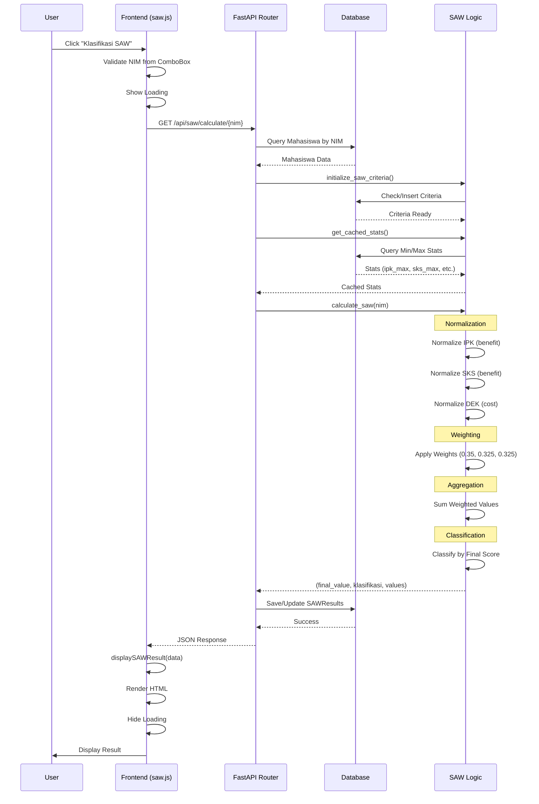

# Dokumentasi Alur Klasifikasi SAW (Simple Additive Weighting)

## 📋 Daftar Isi
1. [Overview](#overview)
2. [Diagram Alur Lengkap](#diagram-alur-lengkap)
3. [Detail Proses Frontend](#detail-proses-frontend)
4. [Detail Proses Backend](#detail-proses-backend)
5. [Function Reference](#function-reference)
6. [Contoh Request & Response](#contoh-request--response)
7. [Perbedaan dengan FIS](#perbedaan-dengan-fis)

---

## Overview

Aplikasi ini menggunakan **Simple Additive Weighting (SAW)** untuk mengklasifikasikan peluang kelulusan mahasiswa berdasarkan 3 kriteria:
- **IPK** (Indeks Prestasi Kumulatif) - Benefit Criteria
- **SKS** (Satuan Kredit Semester) - Benefit Criteria
- **Persentase Nilai D/E/K** (Persentase nilai D, E, dan K) - Cost Criteria

Alur klasifikasi dimulai ketika user mengklik tombol "Klasifikasi SAW" di frontend, kemudian data dikirim ke backend melalui HTTP request, diproses menggunakan metode SAW (normalisasi, pembobotan, dan agregasi), dan hasilnya dikembalikan ke frontend untuk ditampilkan.

**Metode SAW:**
1. **Normalisasi** - Mengubah nilai kriteria ke skala 0-1
2. **Pembobotan** - Mengalikan nilai normalisasi dengan bobot kriteria
3. **Agregasi** - Menjumlahkan nilai terbobot untuk mendapatkan skor akhir
4. **Klasifikasi** - Mengkategorikan berdasarkan skor akhir

---

## Diagram Alur Lengkap

```
┌─────────────────────────────────────────────────────────────────────────┐
│                           FRONTEND (Browser)                             │
└─────────────────────────────────────────────────────────────────────────┘
                                    │
                                    │ 1. User Click
                                    ▼
                    ┌───────────────────────────────┐
                    │  createSAWForm()              │
                    │  $("#btnKlasifikasiSAW").click()│
                    └───────────────┬───────────────┘
                                    │
                                    │ 2. Validasi NIM
                                    ▼
                    ┌───────────────────────────────┐
                    │  Validasi NIM dari dropdown   │
                    │  Kendo ComboBox               │
                    └───────────────┬───────────────┘
                                    │
                                    │ 3. Tampilkan Loading
                                    ▼
                    ┌───────────────────────────────┐
                    │  $("#loadingIndicatorSAW")     │
                    │  .show()                       │
                    └───────────────┬───────────────┘
                                    │
                                    │ 4. HTTP GET Request
                                    ▼
┌─────────────────────────────────────────────────────────────────────────┐
│                    HTTP REQUEST (AJAX)                                   │
│  GET /api/saw/calculate/{nim}                                            │
│  Headers: Content-Type: application/json                                 │
└─────────────────────────────────────────────────────────────────────────┘
                                    │
                                    ▼
┌─────────────────────────────────────────────────────────────────────────┐
│                        BACKEND (FastAPI)                                 │
└─────────────────────────────────────────────────────────────────────────┘
                                    │
                                    │ 5. Router Handler
                                    ▼
                    ┌───────────────────────────────┐
                    │  @router.get("/calculate/{nim}")│
                    │  calculate_saw_individual()   │
                    └───────────────┬───────────────┘
                                    │
                                    │ 6. Query Database
                                    ▼
                    ┌───────────────────────────────┐
                    │  db.query(Mahasiswa)          │
                    │  .filter(Mahasiswa.nim == nim) │
                    │  .first()                     │
                    └───────────────┬───────────────┘
                                    │
                                    │ 7. Cek Data Mahasiswa
                                    ▼
                    ┌───────────────────────────────┐
                    │  Validasi mahasiswa exists     │
                    │  Ambil: ipk, sks, persen_dek   │
                    └───────────────┬───────────────┘
                                    │
                                    │ 8. Initialize Criteria
                                    ▼
                    ┌───────────────────────────────┐
                    │  initialize_saw_criteria(db)  │
                    │  - Cek apakah kriteria ada     │
                    │  - Insert jika belum ada       │
                    └───────────────┬───────────────┘
                                    │
                                    │ 9. Get Min/Max Stats
                                    ▼
                    ┌───────────────────────────────┐
                    │  get_cached_stats(db)         │
                    │  - Query min/max dari DB       │
                    │  - Cache untuk efisiensi       │
                    │  - Return: ipk_max, sks_max,   │
                    │    nilai_dek_min, nilai_dek_max│
                    └───────────────┬───────────────┘
                                    │
                                    │ 10. SAW Processing
                                    ▼
                    ┌───────────────────────────────┐
                    │  calculate_saw(db, nim)       │
                    └───────────────┬───────────────┘
                                    │
                                    │ 11. Normalisasi
                                    ▼
        ┌───────────────────────────────────────────┐
        │  Normalisasi Kriteria:                     │
        │  - IPK (benefit): nilai / ipk_max          │
        │  - SKS (benefit): nilai / sks_max          │
        │  - DEK (cost): nilai_dek_min / nilai       │
        │    (jika nilai = 0, gunakan 0.01)         │
        └───────────────────┬───────────────────────┘
                            │
                            │ 12. Pembobotan
                            ▼
        ┌───────────────────────────────────────────┐
        │  Weighted Values:                          │
        │  - IPK: normalized * 0.35                  │
        │  - SKS: normalized * 0.325                 │
        │  - DEK: normalized * 0.325                 │
        └───────────────────┬───────────────────────┘
                            │
                            │ 13. Agregasi
                            ▼
        ┌───────────────────────────────────────────┐
        │  Final Score:                              │
        │  final_value = sum(weighted_values)       │
        └───────────────────┬───────────────────────┘
                            │
                            │ 14. Klasifikasi
                            ▼
        ┌───────────────────────────────────────────┐
        │  Klasifikasi berdasarkan skor:            │
        │  - final_value >= 0.7 → Tinggi            │
        │  - final_value >= 0.45 → Sedang          │
        │  - final_value < 0.45 → Kecil             │
        └───────────────────┬───────────────────────┘
                            │
                            │ 15. Save to Database
                            ▼
                    ┌───────────────────────────────┐
                    │  save_saw_result()            │
                    │  save_saw_final_result()      │
                    │  - Update atau Insert baru     │
                    │  db.commit()                   │
                    └───────────────┬───────────────┘
                                    │
                                    │ 16. Format Response
                                    ▼
                    ┌───────────────────────────────┐
                    │  Return JSON Response         │
                    │  - nim, nama, program_studi    │
                    │  - criteria_values             │
                    │  - normalized_values           │
                    │  - weighted_values             │
                    │  - final_value, klasifikasi     │
                    └───────────────┬───────────────┘
                                    │
                                    │ 17. HTTP Response
                                    ▼
┌─────────────────────────────────────────────────────────────────────────┐
│                    HTTP RESPONSE (JSON)                                  │
│  Status: 200 OK                                                          │
│  Body: { nim, nama, criteria_values, normalized_values, ... }           │
└─────────────────────────────────────────────────────────────────────────┘
                                    │
                                    ▼
┌─────────────────────────────────────────────────────────────────────────┐
│                           FRONTEND (Browser)                             │
└─────────────────────────────────────────────────────────────────────────┘
                                    │
                                    │ 18. Success Handler
                                    ▼
                    ┌───────────────────────────────┐
                    │  success: function(data)       │
                    │  - displaySAWResult(data)      │
                    │  - Render HTML dengan hasil    │
                    │  - Show notification           │
                    └───────────────┬───────────────┘
                                    │
                                    │ 19. Sembunyikan Loading
                                    ▼
                    ┌───────────────────────────────┐
                    │  $("#loadingIndicatorSAW")     │
                    │  .hide()                       │
                    └───────────────────────────────┘
```

---

## Detail Proses Frontend

### 1. Inisialisasi Form SAW

**File:** `src/frontend/js/saw.js`

**Function:** `createSAWForm()`

```javascript
function createSAWForm() {
    // Initialize dropdown mahasiswa
    loadMahasiswaDropdown();
    
    // Initialize form button
    $("#btnKlasifikasiSAW").click(function(e) {
        e.preventDefault();
        const dropdown = $("#mahasiswaDropdownSAW").data("kendoComboBox");
        if (dropdown && dropdown.value()) {
            const nim = dropdown.value();
            calculateSAW(nim);
        } else {
            showNotification("Error", "Pilih mahasiswa terlebih dahulu", "error");
        }
    });
}
```

**Lokasi:** Dipanggil saat halaman SAW dimuat (`initializeSAWSection()`)

### 2. Load Mahasiswa Dropdown

**Function:** `loadMahasiswaDropdown()`

**Proses:**
1. **Initialize Kendo ComboBox** dengan data source dari API
2. **Auto-complete** untuk pencarian mahasiswa
3. **Limit** 20 hasil per pencarian

### 3. User Click Handler

**Function:** `$("#btnKlasifikasiSAW").click()`

**Proses:**
1. **Ambil NIM** dari Kendo ComboBox
2. **Validasi NIM** - pastikan tidak kosong
3. **Tampilkan loading** indicator
4. **Panggil** `calculateSAW(nim)`

### 4. Calculate SAW Function

**Function:** `calculateSAW(nim)`

**Proses:**
1. **Show loading** indicator
2. **Show result section** (`#hasilKlasifikasiSAW`)
3. **Clear previous result** (`#hasilDetailSAW`)
4. **Send HTTP Request** menggunakan jQuery AJAX

**Code:**
```javascript
function calculateSAW(nim) {
    $("#hasilKlasifikasiSAW").show();
    $("#loadingIndicatorSAW").show();
    $("#hasilDetailSAW").html('');
    
    $.ajax({
        url: CONFIG.getApiUrl(CONFIG.ENDPOINTS.SAW + '/calculate/' + nim),
        type: 'GET',
        success: function(data) {
            $("#loadingIndicatorSAW").hide();
            displaySAWResult(data);
        },
        error: function(xhr, status, error) {
            $("#loadingIndicatorSAW").hide();
            // Handle error
        }
    });
}
```

### 5. HTTP Request

**Method:** `GET`
**URL:** `${CONFIG.getApiUrl(CONFIG.ENDPOINTS.SAW)}/calculate/${nim}`
**Contoh:** `http://localhost:8000/api/saw/calculate/18602241076`

### 6. Success Handler

**Function:** `success: function(data)`

**Proses:**
1. **Hide loading** indicator
2. **Display result** menggunakan `displaySAWResult(data)`

### 7. Display SAW Result

**Function:** `displaySAWResult(data)`

**Proses:**
1. **Validasi data** - pastikan data tidak null/undefined
2. **Get classification color** berdasarkan kategori
3. **Render HTML** dengan hasil klasifikasi
4. **Display** di section `#hasilDetailSAW`

**Data yang ditampilkan:**
- Informasi Mahasiswa (NIM, Nama, Program Studi)
- Nilai Kriteria (IPK, SKS, Persen D/E/K)
- Nilai Normalisasi untuk setiap kriteria
- Nilai Terbobot untuk setiap kriteria
- Skor SAW Final
- Klasifikasi (Tinggi/Sedang/Kecil)

### 8. Error Handler

**Function:** `error: function(xhr, status, error)`

**Proses:**
1. **Hide loading** indicator
2. **Extract error message** dari `xhr.responseJSON.detail`
3. **Display error** di result section

---

## Detail Proses Backend

### 1. Router Endpoint

**File:** `src/backend/routers/saw.py`

**Endpoint:** `@router.get("/calculate/{nim}")`

**Function:** `calculate_saw_individual(nim: str, db: Session = Depends(get_db))`

**Deklarasi:**
```python
@router.get("/calculate/{nim}")
def calculate_saw_individual(nim: str, db: Session = Depends(get_db)):
    """
    Menghitung SAW untuk mahasiswa individual berdasarkan NIM
    """
```

### 2. Query Database

**Proses:**
1. **Query Mahasiswa** berdasarkan NIM
2. **Validasi** mahasiswa exists
3. **Ambil data:** `ipk`, `sks`, `persen_dek`

**Code:**
```python
mahasiswa = db.query(Mahasiswa).filter(Mahasiswa.nim == nim).first()
if not mahasiswa:
    raise HTTPException(status_code=404, detail=f"Mahasiswa dengan NIM {nim} tidak ditemukan")
```

### 3. Initialize SAW Criteria

**Function:** `initialize_saw_criteria(db)`

**Proses:**
1. **Cek** apakah kriteria sudah ada di database
2. **Insert** jika belum ada:
   - IPK: weight 0.35, benefit
   - SKS: weight 0.325, benefit
   - Nilai D/E/K: weight 0.325, cost

### 4. Get Min/Max Statistics

**Function:** `get_cached_stats(db)`

**Proses:**
1. **Check cache** - jika masih valid (< 5 menit), return dari cache
2. **Query database** untuk mendapatkan:
   - `ipk_max` - nilai IPK maksimum
   - `sks_max` - nilai SKS maksimum
   - `nilai_dek_min` - nilai D/E/K minimum
   - `nilai_dek_max` - nilai D/E/K maksimum
3. **Update cache** dengan hasil query
4. **Return** statistik

**Caching:** Cache berlaku selama 5 menit untuk efisiensi query

### 5. SAW Processing

**File:** `src/backend/saw_logic.py`

**Function:** `calculate_saw(db, nim, save_to_db=True)`

**Proses:**

#### 5.1. Ambil Nilai Kriteria

**Input:** Data mahasiswa dari database
**Output:** Dictionary dengan nilai kriteria

```python
criteria_values = {
    "IPK": float(mahasiswa.ipk),
    "SKS": float(mahasiswa.sks),
    "Nilai D/E/K": float(mahasiswa.persen_dek)
}
```

#### 5.2. Normalisasi

**Formula Normalisasi:**

**Benefit Criteria (IPK, SKS):**
```
normalized = nilai / nilai_max
```

**Cost Criteria (Nilai D/E/K):**
```
normalized = nilai_min / nilai
```
*Catatan: Jika nilai = 0, gunakan 0.01 untuk menghindari pembagian nol*

**Code:**
```python
# IPK (benefit)
normalized_ipk = criteria_values["IPK"] / ipk_max

# SKS (benefit)
normalized_sks = criteria_values["SKS"] / sks_max

# Nilai D/E/K (cost)
nilai_dek_fix = criteria_values["Nilai D/E/K"]
if nilai_dek_fix == 0:
    nilai_dek_fix = 0.01
normalized_dek = nilai_dek_min / nilai_dek_fix
```

#### 5.3. Pembobotan (Weighting)

**Bobot Kriteria:**
- IPK: **0.35** (35%)
- SKS: **0.325** (32.5%)
- Nilai D/E/K: **0.325** (32.5%)

**Formula:**
```
weighted_value = normalized_value * weight
```

**Code:**
```python
weights = {
    "IPK": 0.35,
    "SKS": 0.325,
    "Nilai D/E/K": 0.325
}

weighted_values = {
    "IPK": normalized_values["IPK"] * weights["IPK"],
    "SKS": normalized_values["SKS"] * weights["SKS"],
    "Nilai D/E/K": normalized_values["Nilai D/E/K"] * weights["Nilai D/E/K"]
}
```

#### 5.4. Agregasi (Final Score)

**Formula:**
```
final_value = sum(weighted_values)
```

**Code:**
```python
final_value = sum(weighted_values.values())
```

#### 5.5. Klasifikasi

**Threshold:**
- `final_value >= 0.7` → **Peluang Lulus Tinggi**
- `0.45 <= final_value < 0.7` → **Peluang Lulus Sedang**
- `final_value < 0.45` → **Peluang Lulus Kecil**

**Code:**
```python
if final_value >= 0.7:
    klasifikasi = "Peluang Lulus Tinggi"
elif final_value >= 0.45:
    klasifikasi = "Peluang Lulus Sedang"
else:
    klasifikasi = "Peluang Lulus Kecil"
```

### 6. Save to Database

**Functions:**
- `save_saw_result(db, nim, final_value, ranking)` - Simpan ke `saw_results`
- `save_saw_final_result(db, nim, final_value, rank)` - Simpan ke `saw_final_results`

**Proses:**
1. **Cek existing** hasil untuk NIM tersebut
2. **Update** jika sudah ada, atau **Insert** jika baru
3. **Commit** perubahan ke database

**Code:**
```python
if save_to_db:
    ranking = 1  # Default ranking (akan diupdate di batch)
    save_saw_result(db, nim, final_value, ranking)
    save_saw_final_result(db, nim, final_value, ranking)
```

### 7. Format Response

**Response Structure:**
```python
{
    "nim": "18602241076",
    "nama": "Nama Mahasiswa",
    "ipk": 3.4,
    "sks": 150,
    "persen_dek": 0.0,
    "criteria_values": {
        "IPK": 3.4,
        "SKS": 150.0,
        "Nilai D/E/K": 0.0
    },
    "normalized_values": {
        "IPK": 0.85,
        "SKS": 0.75,
        "Nilai D/E/K": 1.0
    },
    "weighted_values": {
        "IPK": 0.2975,
        "SKS": 0.24375,
        "Nilai D/E/K": 0.325
    },
    "final_value": 0.86625,
    "klasifikasi": "Peluang Lulus Tinggi"
}
```

---

## Function Reference

### Frontend Functions

#### `initializeSAWSection()`
**File:** `src/frontend/js/saw.js:2`
**Deskripsi:** Inisialisasi section SAW saat halaman dimuat
**Dependencies:** jQuery, Kendo UI

#### `createSAWForm()`
**File:** `src/frontend/js/saw.js:167`
**Deskripsi:** Membuat form SAW dengan dropdown mahasiswa dan tombol klasifikasi
**Proses:**
- Load mahasiswa dropdown
- Setup event handler untuk tombol klasifikasi

#### `loadMahasiswaDropdown()`
**File:** `src/frontend/js/saw.js:184`
**Deskripsi:** Initialize Kendo ComboBox untuk dropdown mahasiswa
**Features:**
- Auto-complete search
- Limit 20 hasil
- Remote data source

#### `calculateSAW(nim)`
**File:** `src/frontend/js/saw.js:248`
**Deskripsi:** Fungsi utama untuk menghitung SAW
**Parameter:** `nim` - Nomor Induk Mahasiswa
**Proses:**
- Show loading
- Send AJAX request
- Handle response

#### `displaySAWResult(data)`
**File:** `src/frontend/js/saw.js:269`
**Deskripsi:** Menampilkan hasil klasifikasi SAW ke HTML
**Parameter:** `data` - JSON response dari API
**Output:** HTML dengan hasil lengkap

#### `getClassificationColor(classification)`
**File:** `src/frontend/js/saw.js:356`
**Deskripsi:** Mendapatkan warna berdasarkan kategori
**Return:** Hex color code
- Tinggi: `#28a745` (green)
- Sedang: `#ffc107` (yellow)
- Kecil: `#dc3545` (red)

#### `getClassificationThreshold(classification)`
**File:** `src/frontend/js/saw.js:367`
**Deskripsi:** Mendapatkan threshold text untuk kategori
**Return:** String threshold

#### `initializeBatchButton()`
**File:** `src/frontend/js/saw.js:86`
**Deskripsi:** Initialize event handler untuk batch klasifikasi
**Proses:**
- Show before/after comparison
- Call batch API endpoint

### Backend Functions

#### `calculate_saw_individual(nim, db)`
**File:** `src/backend/routers/saw.py:69`
**Deskripsi:** Router handler untuk GET request klasifikasi SAW individual
**Parameter:**
- `nim: str` - Nomor Induk Mahasiswa
- `db: Session` - Database session
**Return:** JSON response dengan hasil klasifikasi

#### `calculate_saw(db, nim, save_to_db=True)`
**File:** `src/backend/saw_logic.py:150`
**Deskripsi:** Fungsi utama untuk menghitung SAW untuk satu mahasiswa
**Parameter:**
- `db: Session` - Database session
- `nim: str` - Nomor Induk Mahasiswa
- `save_to_db: bool` - Apakah menyimpan ke database
**Return:** Dictionary dengan hasil perhitungan

#### `get_cached_stats(db)`
**File:** `src/backend/saw_logic.py:17`
**Deskripsi:** Mendapatkan statistik min/max dengan caching
**Return:** Dictionary dengan `ipk_max`, `sks_max`, `nilai_dek_min`, `nilai_dek_max`
**Cache Duration:** 5 menit

#### `initialize_saw_criteria(db)`
**File:** `src/backend/saw_logic.py:62`
**Deskripsi:** Inisialisasi kriteria SAW di database jika belum ada
**Proses:**
- Cek jumlah kriteria
- Insert 3 kriteria default jika kosong

#### `save_saw_result(db, nim, final_score, ranking)`
**File:** `src/backend/saw_logic.py:88`
**Deskripsi:** Menyimpan hasil SAW ke tabel `saw_results`
**Return:** `SAWResults` object

#### `save_saw_final_result(db, nim, final_score, rank)`
**File:** `src/backend/saw_logic.py:118`
**Deskripsi:** Menyimpan hasil SAW final ke tabel `saw_final_results`
**Return:** `SAWFinalResults` object

#### `batch_calculate_saw(db, save_to_db=True, use_labeled_data_only=False)`
**File:** `src/backend/saw_logic.py:258`
**Deskripsi:** Menghitung SAW untuk semua mahasiswa sekaligus
**Parameter:**
- `use_labeled_data_only: bool` - Jika True, min/max hanya dari data berlabel
**Return:** List of dictionaries dengan hasil perhitungan

---

## Contoh Request & Response

### Request

**Method:** `GET`
**URL:** `http://localhost:8000/api/saw/calculate/18602241076`
**Headers:**
```
Content-Type: application/json
```

**No Body** (GET request)

### Response Success (200 OK)

```json
{
    "nim": "18602241076",
    "nama": "John Doe",
    "ipk": 3.4,
    "sks": 150,
    "persen_dek": 0.0,
    "criteria_values": {
        "IPK": 3.4,
        "SKS": 150.0,
        "Nilai D/E/K": 0.0
    },
    "normalized_values": {
        "IPK": 0.85,
        "SKS": 0.75,
        "Nilai D/E/K": 1.0
    },
    "weighted_values": {
        "IPK": 0.2975,
        "SKS": 0.24375,
        "Nilai D/E/K": 0.325
    },
    "final_value": 0.86625,
    "klasifikasi": "Peluang Lulus Tinggi"
}
```

### Response Error (404 Not Found)

```json
{
    "detail": "Mahasiswa dengan NIM 18602241076 tidak ditemukan"
}
```

### Response Error (500 Internal Server Error)

```json
{
    "detail": "Terjadi kesalahan saat menghitung SAW: [error message]"
}
```

---

## Diagram Sequence



---

## Perbedaan dengan FIS

### Metode Perhitungan

| Aspek | FIS (Fuzzy Inference System) | SAW (Simple Additive Weighting) |
|-------|------------------------------|----------------------------------|
| **Metode** | Fuzzy Logic dengan rules | Weighted sum dengan normalisasi |
| **Input Processing** | Fuzzifikasi → Membership values | Normalisasi → Skala 0-1 |
| **Inferensi** | 20 Fuzzy Rules dengan min/max | Tidak ada inferensi |
| **Defuzzifikasi** | Weighted average | Tidak ada defuzzifikasi |
| **Agregasi** | Tidak ada | Sum of weighted values |
| **Klasifikasi** | Berdasarkan nilai crisp | Berdasarkan final score |

### Normalisasi

**FIS:**
- Tidak menggunakan normalisasi
- Menggunakan membership functions (trapezoid, triangle)

**SAW:**
- **Benefit Criteria:** `nilai / nilai_max`
- **Cost Criteria:** `nilai_min / nilai`

### Bobot

**FIS:**
- Tidak menggunakan bobot eksplisit
- Bobot implisit dalam fuzzy rules

**SAW:**
- **IPK:** 0.35 (35%)
- **SKS:** 0.325 (32.5%)
- **Nilai D/E/K:** 0.325 (32.5%)

### Klasifikasi Threshold

**FIS:**
- Berdasarkan nilai crisp (0-100)
- `>= 60` → Tinggi
- `40-60` → Sedang
- `< 40` → Kecil

**SAW:**
- Berdasarkan final score (0-1)
- `>= 0.7` → Tinggi
- `0.45-0.7` → Sedang
- `< 0.45` → Kecil

### Database Storage

**FIS:**
- Tabel: `klasifikasi_kelulusan`
- Fields: `nim`, `kategori`, `nilai_fuzzy`, `ipk_membership`, `sks_membership`, `nilai_dk_membership`

**SAW:**
- Tabel: `saw_results`, `saw_final_results`
- Fields: `nim`, `nilai_akhir`, `ranking`, `final_score`, `rank`

---

## Teknologi yang Digunakan

### Frontend
- **jQuery** - DOM manipulation dan AJAX
- **Kendo UI** - UI components (ComboBox, Grid)
- **JavaScript (ES6+)** - Logic dan event handling

### Backend
- **FastAPI** - Web framework
- **SQLAlchemy** - ORM untuk database
- **Python 3.x** - Programming language
- **SAW Algorithm** - Custom implementation

### Database
- **PostgreSQL** - Relational database
- **Tables:**
  - `mahasiswa` - Data mahasiswa
  - `saw_results` - Hasil perhitungan SAW
  - `saw_final_results` - Hasil final SAW
  - `saw_criteria` - Kriteria dan bobot SAW

---

## Batch Classification

### Endpoint Batch

**URL:** `/api/saw/batch-labeled`
**Method:** `GET`
**Deskripsi:** Menghitung SAW untuk semua mahasiswa menggunakan data berlabel untuk normalisasi

**Perbedaan dengan `/api/saw/batch`:**
- `/api/saw/batch`: Min/max dari seluruh data
- `/api/saw/batch-labeled`: Min/max hanya dari data yang memiliki `status_lulus_aktual`

**Alasan:** Konsistensi dengan hasil evaluasi SAW dengan data aktual

### Proses Batch

1. **Query semua mahasiswa**
2. **Get min/max** (dari seluruh data atau data berlabel)
3. **Loop** untuk setiap mahasiswa:
   - Normalisasi
   - Pembobotan
   - Agregasi
   - Klasifikasi
4. **Hitung ranking** berdasarkan final score
5. **Save to database** (batch)
6. **Return** hasil lengkap

---

## Catatan Penting

1. **Normalisasi Cost Criteria:** Formula `min / nilai` untuk kriteria cost (Nilai D/E/K)
2. **Division by Zero:** Jika nilai D/E/K = 0, gunakan 0.01 untuk menghindari pembagian nol
3. **Caching:** Statistik min/max di-cache selama 5 menit untuk efisiensi
4. **Batch Processing:** Menggunakan min/max yang sama untuk seluruh batch agar konsisten
5. **Labeled Data:** Endpoint `/batch-labeled` menggunakan hanya data berlabel untuk normalisasi

---

## Troubleshooting

### Masalah: NIM tidak ditemukan
**Solusi:** Pastikan NIM valid dan ada di database

### Masalah: Response error 500
**Solusi:** Cek log backend untuk detail error, pastikan database connection OK

### Masalah: Normalisasi menghasilkan nilai > 1
**Solusi:** Cek apakah min/max stats benar, pastikan tidak ada data anomali

### Masalah: Final score tidak sesuai
**Solusi:** 
- Cek bobot kriteria (harus total 1.0)
- Cek normalisasi (benefit: nilai/max, cost: min/nilai)
- Cek agregasi (sum of weighted values)

### Masalah: Klasifikasi tidak sesuai threshold
**Solusi:** Pastikan threshold yang digunakan:
- `>= 0.7` untuk Tinggi
- `>= 0.45` untuk Sedang
- `< 0.45` untuk Kecil

---

## Contoh Perhitungan Lengkap

### Input
- **NIM:** 18602241076
- **IPK:** 3.4
- **SKS:** 150
- **Persen D/E/K:** 0.0%

### Stats (Min/Max)
- **IPK Max:** 4.0
- **SKS Max:** 200
- **DEK Min:** 0.0
- **DEK Max:** 70.0

### Normalisasi

**IPK (Benefit):**
```
normalized_ipk = 3.4 / 4.0 = 0.85
```

**SKS (Benefit):**
```
normalized_sks = 150 / 200 = 0.75
```

**DEK (Cost):**
```
nilai_dek = 0.0 → gunakan 0.01
normalized_dek = 0.0 / 0.01 = 0.0
```
*Catatan: Dalam implementasi, jika nilai = 0, gunakan 0.01 untuk pembagi*

### Pembobotan

**IPK:**
```
weighted_ipk = 0.85 × 0.35 = 0.2975
```

**SKS:**
```
weighted_sks = 0.75 × 0.325 = 0.24375
```

**DEK:**
```
weighted_dek = 0.0 × 0.325 = 0.0
```

### Agregasi

```
final_value = 0.2975 + 0.24375 + 0.0 = 0.54125
```

### Klasifikasi

```
final_value = 0.54125
0.45 <= 0.54125 < 0.7
→ Klasifikasi: "Peluang Lulus Sedang"
```

---

**Dokumentasi ini dibuat untuk membantu developer memahami alur klasifikasi SAW dari frontend hingga backend.**

