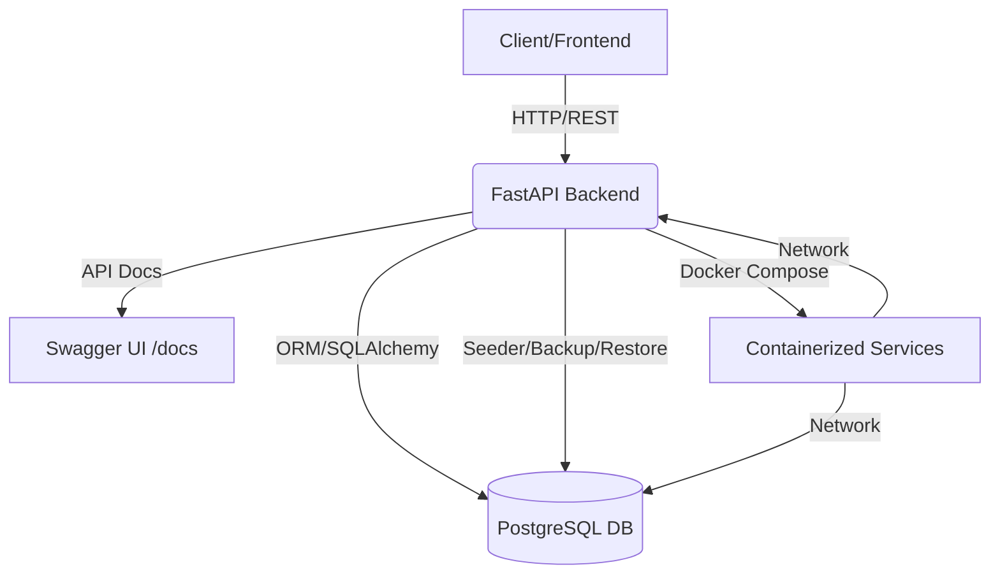

# 🐍 Dokumentasi Backend - SPK Monitoring Masa Studi

## Ringkasan
Backend aplikasi ini dibangun dengan Python FastAPI, PostgreSQL, dan Docker. Backend bertanggung jawab untuk logika bisnis, pengelolaan data, API, dan integrasi dengan frontend.

---

## 🗺️ Diagram Arsitektur Backend



---

## 📋 Tabel Modul Utama Backend

| Modul/Folder     | Fungsi Utama                                      |
|-----------------|---------------------------------------------------|
| alembic/        | Migrasi database (skema, versi)                   |
| routers/        | API modular: mahasiswa, nilai, saw, fuzzy, dsb    |
| tools/          | Script utilitas: backup, restore, seeder, test    |
| models.py       | Definisi model SQLAlchemy (tabel, relasi)         |
| schemas.py      | Validasi data (Pydantic)                          |
| database.py     | Koneksi & session database                        |
| main.py         | Entry point FastAPI, inisialisasi app & router    |
| config.py       | Konfigurasi environment, variabel global          |
| requirements.txt| Daftar dependensi Python                          |

---

## 1. Teknologi Utama
- **Python 3.9+**: Bahasa utama backend
- **FastAPI**: Framework web modern, async, dan high-performance
- **PostgreSQL**: Database relasional utama
- **SQLAlchemy**: ORM untuk akses database
- **Alembic**: Migrasi skema database
- **Docker**: Containerization & deployment
- **Uvicorn**: ASGI server untuk FastAPI

---

## 2. Struktur Direktori Backend
```
src/backend/
├── alembic/           # Migrasi database
├── routers/           # Modular API routers (mahasiswa, nilai, saw, fuzzy, dsb)
├── tools/             # Script utilitas, backup, restore, seeder
├── models.py          # Definisi model SQLAlchemy
├── schemas.py         # Pydantic schemas (validasi data)
├── database.py        # Koneksi & session database
├── main.py            # Entry point FastAPI
├── config.py          # Konfigurasi environment
├── requirements.txt   # Daftar dependensi Python
```

---

## 3. API & Routing
- **RESTful API**: Semua endpoint mengikuti standar REST
- **Routers modular**: Setiap fitur (mahasiswa, nilai, evaluasi, dsb) punya router sendiri
- **Validasi**: Input divalidasi dengan Pydantic
- **Autentikasi**: (Opsional) JWT/token-based auth
- **Error handling**: Konsisten, response JSON

---

## 4. Database & Migrasi
- **PostgreSQL**: Database utama
- **SQLAlchemy**: ORM, relasi antar tabel
- **Alembic**: Migrasi skema otomatis
- **Seeder**: Script untuk seed data awal
- **Backup/Restore**: Script untuk backup & restore tabel/data

---

## 5. Testing & Pengujian
- **Unit Test**: Test fungsi dan endpoint (pytest, unittest)
- **Integration Test**: Test alur data dan API
- **Test Otomatis**: Script test di `tools/` dan test runner
- **Data Real**: Pengujian dengan data mahasiswa asli

---

## 6. Deployment & CI/CD
- **Docker Compose**: Multi-container (backend, db, frontend)
- **Environment**: File `.env` untuk konfigurasi
- **Build Otomatis**: Pipeline build & deploy (opsional)
- **Dokumentasi API**: Swagger/OpenAPI otomatis di `/docs`

---

## 7. Best Practice
- Modularisasi kode (routers, models, schemas)
- Validasi data ketat
- Logging & error handling
- Backup & migrasi rutin
- Dokumentasi endpoint & struktur data

---

## 📅 Tanggal Update: 2025-07-21
## 📝 Kontributor: Tim Backend 