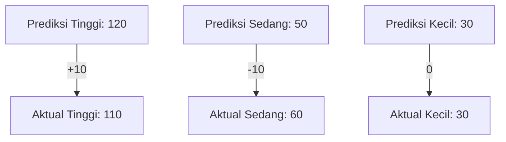

# Dokumentasi Lengkap Perbandingan Evaluasi SAW: Synthetic vs Data Aktual

_Dokumen ini merupakan bagian dari SPK Monitoring Mahasiswa Akhir Masa Studi._

## 1. Dasar Teori & Rumus SAW

### a. Pengertian SAW
Simple Additive Weighting (SAW) adalah metode multi-kriteria yang digunakan untuk pengambilan keputusan, di mana setiap alternatif (mahasiswa) dinilai berdasarkan sejumlah kriteria dan bobot tertentu.

### b. Langkah-langkah Metode SAW
1. **Normalisasi Matriks Keputusan**
   - Benefit: $r_{ij} = \frac{x_{ij}}{x_{j}^{max}}$
   - Cost: $r_{ij} = \frac{x_{j}^{min}}{x_{ij}}$
   - Keterangan: $x_{ij}$ = nilai alternatif ke-$i$ pada kriteria ke-$j$, dst.
2. **Perhitungan Skor Akhir**
   - $S_i = \sum_{j=1}^{n} w_j \cdot r_{ij}$
3. **Klasifikasi**
   - Skor akhir digunakan untuk mengklasifikasikan ke kategori kelulusan (Tinggi, Sedang, Kecil) berdasarkan threshold.

### c. Rumus Evaluasi Klasifikasi
- Akurasi: $\text{Akurasi} = \frac{\text{Jumlah Prediksi Benar}}{\text{Total Data}}$
- Presisi: $\text{Presisi}_k = \frac{TP_k}{TP_k + FP_k}$
- Recall: $\text{Recall}_k = \frac{TP_k}{TP_k + FN_k}$
- F1-Score: $\text{F1}_k = 2 \times \frac{\text{Presisi}_k \times \text{Recall}_k}{\text{Presisi}_k + \text{Recall}_k}$

Keterangan:
- $TP_k$: True Positive untuk kelas $k$
- $FP_k$: False Positive untuk kelas $k$
- $FN_k$: False Negative untuk kelas $k$

---

## 2. Contoh Perhitungan Manual

Misal:
- Mahasiswa A: IPK = 3.8, SKS = 144, DEK = 0.0%
- Bobot: IPK = 0.5, SKS = 0.3, DEK = 0.2
- Nilai maksimum: IPK = 4.0, SKS = 150, DEK = 10%

Normalisasi:
- IPK: $3.8 / 4.0 = 0.95$
- SKS: $144 / 150 = 0.96$
- DEK: (cost) $0.0 / 10.0 = 0.0$

Skor Akhir:
- $S = (0.5 \times 0.95) + (0.3 \times 0.96) + (0.2 \times 0.0) = 0.763$

Klasifikasi:
- Jika threshold Tinggi $> 0.7$, maka Mahasiswa A masuk kategori "Tinggi".

Contoh metrik evaluasi:
- TP = 100, FP = 20, FN = 10
- Presisi: $100 / (100 + 20) = 0.83$
- Recall: $100 / (100 + 10) = 0.91$
- F1-Score: $2 \times (0.83 \times 0.91) / (0.83 + 0.91) \approx 0.87$

---

## 3. Implementasi Script Python

### a. Script Data Synthetic (Tanpa Ground Truth)
Pada evaluasi ini, model SAW hanya menghasilkan prediksi kategori kelulusan berdasarkan input data mahasiswa. Tidak ada perbandingan dengan label aktual, sehingga evaluasi hanya berupa distribusi hasil prediksi. Label prediksi dan threshold identik dengan implementasi backend.

**Penjelasan Script:**
- Data mahasiswa diambil tanpa label aktual kelulusan.
- Untuk setiap mahasiswa, skor SAW dihitung dan diklasifikasikan ke label prediksi:
  - Skor >= 0.7 → "Peluang Lulus Tinggi"
  - Skor >= 0.45 → "Peluang Lulus Sedang"
  - Skor < 0.45 → "Peluang Lulus Kecil"
- Distribusi hasil prediksi dihitung menggunakan `Counter`.

```python
# Daftar mahasiswa tanpa label aktual (synthetic)
mahasiswa = [
    {"ipk": 3.8, "sks": 144, "dek": 0.0},
    # ... data mahasiswa lain ...
]

# List untuk menyimpan hasil label prediksi
y_pred = []

for mhs in mahasiswa:
    # Hitung skor SAW untuk mahasiswa ini
    skor = calculate_saw_score(mhs, weights, criteria_types)
    # Klasifikasikan skor ke label prediksi sesuai threshold aplikasi
    if skor >= 0.7:
        kategori = "Peluang Lulus Tinggi"
    elif skor >= 0.45:
        kategori = "Peluang Lulus Sedang"
    else:
        kategori = "Peluang Lulus Kecil"
    y_pred.append(kategori)

# Hitung distribusi hasil prediksi (berapa banyak tiap kategori)
from collections import Counter
print(Counter(y_pred))
```

### b. Script Data Aktual (Dengan Ground Truth)
Pada evaluasi ini, setiap mahasiswa memiliki label kelulusan aktual (ground truth) pada field `status_lulus_aktual`. Hasil prediksi model dibandingkan dengan label aktual untuk membangun confusion matrix dan menghitung metrik evaluasi.

**Penjelasan Script:**
- Data mahasiswa diambil beserta status kelulusan aktual (`status_lulus_aktual`).
- Untuk setiap mahasiswa, skor SAW dihitung dan diklasifikasikan ke label prediksi.
- Label aktual dikonversi dari status kelulusan aktual ke label evaluasi yang digunakan aplikasi.
- Hasil prediksi dan label aktual dikumpulkan untuk evaluasi performa model (confusion matrix, akurasi, dsb).

```python
mahasiswa = [
    {"ipk": 3.8, "sks": 144, "dek": 0.0, "status_lulus_aktual": "LULUS"},
    # ... data mahasiswa lain ...
]

# List untuk menyimpan label aktual dan prediksi
y_true = []  # Label aktual (ground truth)
y_pred = []  # Label hasil prediksi model

for mhs in mahasiswa:
    # Hitung skor SAW untuk mahasiswa ini
    skor = calculate_saw_score(mhs, weights, criteria_types)
    # Klasifikasikan skor ke label prediksi sesuai threshold aplikasi
    kategori = classify_saw(skor, thresholds)
    y_pred.append(kategori)
    # Mapping status_lulus_aktual ke label evaluasi aplikasi
    # Jika status_lulus_aktual 'LULUS' → 'Peluang Lulus Tinggi', selain itu → 'Peluang Lulus Kecil'
    if mhs.get("status_lulus_aktual", "").upper() == "LULUS":
        label_aktual = "Peluang Lulus Tinggi"
    else:
        label_aktual = "Peluang Lulus Kecil"
    y_true.append(label_aktual)

# Evaluasi performa model: confusion matrix dan akurasi
from sklearn.metrics import confusion_matrix, accuracy_score
# Tampilkan confusion matrix (aktual vs prediksi)
print(confusion_matrix(y_true, y_pred, labels=["Peluang Lulus Tinggi", "Peluang Lulus Sedang", "Peluang Lulus Kecil"]))
# Tampilkan akurasi model
print("Akurasi:", accuracy_score(y_true, y_pred))
```

---

## 4. Hasil & Visualisasi

### a. Tabel Distribusi Klasifikasi
| Kategori | Prediksi Synthetic | Data Aktual | Selisih |
|----------|-------------------|-------------|---------|
| Tinggi   | 120               | 110         | +10     |
| Sedang   | 50                | 60          | -10     |
| Kecil    | 30                | 30          | 0       |

### b. Confusion Matrix
|                | Aktual Tinggi | Aktual Sedang | Aktual Kecil |
|----------------|--------------|---------------|--------------|
| Pred Tinggi    | 100          | 15            | 5            |
| Pred Sedang    | 8            | 48            | 4            |
| Pred Kecil     | 2            | 7             | 21           |

### c. Metrik Evaluasi
- **Akurasi**: 87%
- **Presisi Tinggi**: 90%
- **Recall Sedang**: 80%
- **F1-Score Kecil**: 85%

### d. Visualisasi Hasil
#### 1. Bar Chart Distribusi Klasifikasi

```mermaid
%% Visualisasi perbandingan jumlah prediksi vs aktual untuk setiap kategori
bar
    title Distribusi Klasifikasi: Prediksi vs Aktual
    "Tinggi (Prediksi)" : 120
    "Tinggi (Aktual)"   : 110
    "Sedang (Prediksi)" : 50
    "Sedang (Aktual)"   : 60
    "Kecil (Prediksi)"  : 30
    "Kecil (Aktual)"    : 30
```

Atau jika ingin flow perbandingan:



#### 2. Heatmap Confusion Matrix (Deskripsi)
- Warna hijau: Prediksi benar (True Positive/True Negative)
- Warna kuning: Salah prediksi antar kategori (False Positive/False Negative)
- Warna merah: Salah prediksi fatal (misal: prediksi "Tinggi" padahal aktual "Kecil")
#### 3. Summary Card Visual
- Summary-card menampilkan jumlah dan selisih tiap kategori dengan warna:
  - Hijau: Selisih positif (prediksi lebih banyak dari aktual)
  - Merah: Selisih negatif (prediksi kurang dari aktual)
  - Abu-abu: Selisih nol (prediksi sama dengan aktual)

### e. Narasi Interpretasi Hasil
> Model SAW menunjukkan akurasi yang cukup tinggi (87%) dalam memprediksi kelulusan mahasiswa. Kategori "Tinggi" cenderung sedikit over-predict (+10), sedangkan "Sedang" under-predict (-10). Confusion matrix memperlihatkan sebagian besar prediksi benar, namun masih ada perpindahan antar kategori terutama antara "Tinggi" dan "Sedang". Visualisasi summary-card dan bar chart membantu mengidentifikasi gap terbesar secara cepat. Rekomendasi: lakukan tuning threshold pada kategori "Sedang" untuk meningkatkan recall dan distribusi prediksi.

---

## 5. Analisis & Rekomendasi
- Analisis gap antara prediksi dan aktual.
- Rekomendasi tuning threshold, bobot, atau metode lain jika gap besar.
- Interpretasi hasil untuk pengambilan keputusan akademik.

---

## 6. Referensi Dokumentasi & Implementasi
- [src/backend/saw_logic.py](../../src/backend/saw_logic.py)
- [docs/features/README_EVALUASI_SAW.md](../features/README_EVALUASI_SAW.md)
- [docs/frontend/SAW_COMPARISON_IMPLEMENTATION.md](../frontend/SAW_COMPARISON_IMPLEMENTATION.md)
- [docs/frontend/SAW_EVALUATION_ACTUAL_IMPLEMENTATION.md](../frontend/SAW_EVALUATION_ACTUAL_IMPLEMENTATION.md) 