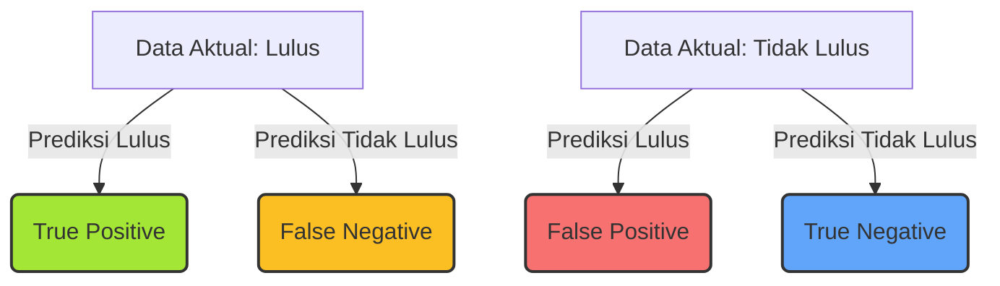

# 📊 Dokumentasi Proses Evaluasi FIS (Fuzzy Inference System)

## 1. Dasar Teori FIS
Fuzzy Inference System (FIS) adalah sistem pengambilan keputusan berbasis logika fuzzy yang mampu menangani ketidakpastian dan data linguistik. FIS digunakan untuk mengklasifikasikan peluang kelulusan mahasiswa berdasarkan parameter seperti IPK, SKS, dan DEK.

### Komponen Utama FIS:
- **Fuzzyfikasi**: Mengubah data numerik menjadi derajat keanggotaan fuzzy.
- **Basis Aturan (Rule Base)**: Kumpulan aturan IF-THEN berbasis pengetahuan domain.
- **Inferensi**: Proses penarikan kesimpulan dari aturan fuzzy.
- **Defuzzifikasi**: Mengubah output fuzzy menjadi nilai crisp (tegas).

---

## 2. Rumus & Formula
### a. Membership Function (Fuzzyfikasi)
Contoh fungsi keanggotaan segitiga/trapesium:

- **Fungsi Segitiga**
  \[
  \mu_A(x) = \begin{cases}
    0 & x \leq a \\
    \frac{x-a}{b-a} & a < x < b \\
    \frac{c-x}{c-b} & b \leq x < c \\
    0 & x \geq c
  \end{cases}
  \]

- **Fungsi Trapesium**
  \[
  \mu_A(x) = \begin{cases}
    0 & x \leq a \\
    \frac{x-a}{b-a} & a < x < b \\
    1 & b \leq x < c \\
    \frac{d-x}{d-c} & c \leq x < d \\
    0 & x \geq d
  \end{cases}
  \]

### b. Inferensi (Rule Evaluation)
- Aturan IF-THEN, contoh:
  - IF IPK = Tinggi AND SKS = Banyak THEN Peluang Lulus = Tinggi
- Operator logika: MIN (AND), MAX (OR)

### c. Defuzzifikasi (Weighted Average)
- Output crisp dihitung dengan:
  \[
  z = \frac{\sum_{i=1}^n \mu_i \cdot z_i}{\sum_{i=1}^n \mu_i}
  \]
  - \( \mu_i \): derajat keanggotaan aturan ke-i
  - \( z_i \): nilai output crisp aturan ke-i

---

## 3. Evaluasi Hasil: Confusion Matrix & Metrik Klasifikasi

### f. Visualisasi Confusion Matrix & Metrik Evaluasi

#### 1. **Diagram Mermaid Confusion Matrix**


#### 2. **Tabel Visual Confusion Matrix**
|                | <span style="color:#fff;background:#6366f1;padding:2px 8px;border-radius:6px">Prediksi Lulus</span> | <span style="color:#fff;background:#6366f1;padding:2px 8px;border-radius:6px">Prediksi Tidak Lulus</span> |
|----------------|:------------------:|:----------------------:|
| <span style="color:#fff;background:#22c55e;padding:2px 8px;border-radius:6px">Lulus</span>      | <b style="color:#22c55e">TP</b> (120)            | <b style="color:#fbbf24">FN</b> (10)                   |
| <span style="color:#fff;background:#0ea5e9;padding:2px 8px;border-radius:6px">Tidak Lulus</span>| <b style="color:#f87171">FP</b> (15)             | <b style="color:#60a5fa">TN</b> (55)                   |

- **Hijau (TP):** Prediksi benar lulus
- **Biru (TN):** Prediksi benar tidak lulus
- **Merah (FP):** Salah prediksi lulus
- **Kuning (FN):** Salah prediksi tidak lulus

#### 3. **Visualisasi Metrik Evaluasi**
- **Akurasi:**  87.5%
- **Precision:**  88.9%
- **Recall:**  92.3%
- **F1-Score:**  90.6%

> **Catatan:**
> Visualisasi warna dan badge pada aplikasi membantu user langsung mengenali area kekuatan (hijau/biru) dan kelemahan (merah/kuning) model.

---

### a. Teori Confusion Matrix
Confusion matrix adalah tabel dua dimensi yang digunakan untuk mengevaluasi performa model klasifikasi dengan membandingkan hasil prediksi model dan data aktual (ground truth). Confusion matrix memetakan jumlah prediksi benar dan salah untuk setiap kelas.

#### Struktur Confusion Matrix (Biner)
|                | Prediksi Positif | Prediksi Negatif |
|----------------|------------------|------------------|
| **Aktual Positif** | True Positive (TP) | False Negative (FN) |
| **Aktual Negatif** | False Positive (FP) | True Negative (TN) |

- **True Positive (TP):** Model memprediksi positif dan aktualnya memang positif (benar-benar lulus diprediksi lulus)
- **True Negative (TN):** Model memprediksi negatif dan aktualnya memang negatif (benar-benar tidak lulus diprediksi tidak lulus)
- **False Positive (FP):** Model memprediksi positif padahal aktualnya negatif (tidak lulus diprediksi lulus)
- **False Negative (FN):** Model memprediksi negatif padahal aktualnya positif (lulus diprediksi tidak lulus)

#### Contoh Kasus
Misal dari 200 mahasiswa:
- 120 benar-benar lulus dan diprediksi lulus (**TP**)
- 55 benar-benar tidak lulus dan diprediksi tidak lulus (**TN**)
- 15 tidak lulus tapi diprediksi lulus (**FP**)
- 10 lulus tapi diprediksi tidak lulus (**FN**)

### b. Rumus & Interpretasi Metrik Evaluasi

#### 1. **Akurasi (Accuracy)**
Akurasi mengukur persentase prediksi yang benar dari seluruh data.

**Rumus:**

$$
\text{Akurasi} = \frac{TP + TN}{TP + TN + FP + FN}
$$

**Interpretasi:**
Semakin tinggi akurasi, semakin banyak prediksi model yang benar. Namun, akurasi bisa menipu jika data tidak seimbang (misal: mayoritas lulus).

**Contoh Penghitungan:**

$$
\text{Akurasi} = \frac{120 + 55}{120 + 55 + 15 + 10} = \frac{175}{200} = 87.5\%
$$

---

#### 2. **Precision**
Precision mengukur ketepatan model dalam memprediksi kelas positif (lulus). Dari semua yang diprediksi lulus, berapa yang benar-benar lulus?

**Rumus:**

$$
\text{Precision} = \frac{TP}{TP + FP}
$$

**Interpretasi:**
Precision tinggi berarti sedikit false positive. Penting jika kesalahan prediksi positif harus diminimalkan.

**Contoh Penghitungan:**

$$
\text{Precision} = \frac{120}{120 + 15} = \frac{120}{135} \approx 88.9\%
$$

---

#### 3. **Recall (Sensitivity)**
Recall mengukur kemampuan model menemukan semua data positif (lulus). Dari semua yang benar-benar lulus, berapa yang berhasil diprediksi lulus?

**Rumus:**

$$
\text{Recall} = \frac{TP}{TP + FN}
$$

**Interpretasi:**
Recall tinggi berarti sedikit false negative. Penting jika tidak boleh ada data positif yang terlewat.

**Contoh Penghitungan:**

$$
\text{Recall} = \frac{120}{120 + 10} = \frac{120}{130} \approx 92.3\%
$$

---

#### 4. **F1-Score**
F1-Score adalah rata-rata harmonik antara precision dan recall. Mengukur keseimbangan antara ketepatan dan kelengkapan prediksi.

**Rumus:**

$$
\text{F1-Score} = 2 \times \frac{\text{Precision} \times \text{Recall}}{\text{Precision} + \text{Recall}}
$$

**Interpretasi:**
F1-score tinggi berarti precision dan recall sama-sama baik. Cocok untuk data tidak seimbang.

**Contoh Penghitungan:**

$$
\text{F1-Score} = 2 \times \frac{0.889 \times 0.923}{0.889 + 0.923} \approx 0.906 = 90.6\%
$$

---

### c. Penghitungan di Aplikasi SPK
1. **Prediksi hasil klasifikasi** (Lulus/Tidak Lulus) dibandingkan dengan label aktual dari data mahasiswa.
2. **Bangun confusion matrix** berdasarkan hasil prediksi dan aktual.
3. **Hitung TP, TN, FP, FN** dari confusion matrix.
4. **Hitung metrik** akurasi, precision, recall, dan f1-score menggunakan rumus di atas.
5. **Tampilkan hasil** di frontend dalam bentuk tabel confusion matrix, badge metrik, dan narasi otomatis.
6. **Analisis visual**: Warna, badge, dan narasi membantu user memahami kekuatan dan kelemahan model.

#### Contoh Tabel Confusion Matrix di Aplikasi
|                | Prediksi Lulus | Prediksi Tidak Lulus |
|----------------|----------------|----------------------|
| **Lulus**      | 120            | 10                   |
| **Tidak Lulus**| 15             | 55                   |

- **TP = 120**, **TN = 55**, **FP = 15**, **FN = 10**
- Akurasi, precision, recall, dan f1-score dihitung otomatis dan divisualisasikan di halaman evaluasi.

---

## 4. Logika Penghitungan di Aplikasi
1. **Input**: Data mahasiswa (IPK, SKS, DEK)
2. **Fuzzyfikasi**: Hitung derajat keanggotaan setiap parameter ke fuzzy set (kecil, sedang, tinggi)
3. **Inferensi**: Evaluasi semua aturan fuzzy, ambil MIN untuk AND, MAX untuk OR
4. **Defuzzifikasi**: Hitung output crisp (peluang lulus) dengan weighted average
5. **Klasifikasi**: Output crisp dikategorikan ke kelas (Lulus/Tidak Lulus) berdasarkan threshold
6. **Evaluasi Hasil**: Bangun confusion matrix, hitung metrik akurasi, precision, recall, f1-score

---

## 5. Implementasi pada Aplikasi SPK
- **Backend**: Implementasi logika FIS di `src/backend/fuzzy_logic.py`, endpoint di `routers/fuzzy.py`
- **Frontend**: Input data via form, hasil evaluasi ditampilkan di halaman evaluasi FIS
- **Visualisasi**: Hasil evaluasi, confusion matrix, metrik akurasi, dan narasi otomatis
- **Contoh Alur**:
  1. User input data mahasiswa
  2. Klik evaluasi FIS
  3. Backend melakukan fuzzyfikasi, inferensi, defuzzifikasi
  4. Hasil dikirim ke frontend, divisualisasikan dan dianalisis
  5. Evaluasi hasil (confusion matrix & metrik) ditampilkan otomatis

---

## 6. Contoh Aturan FIS
| Aturan | IPK      | SKS      | DEK      | Output         |
|--------|----------|----------|----------|----------------|
| 1      | Tinggi   | Banyak   | Rendah   | Lulus          |
| 2      | Sedang   | Sedang   | Sedang   | Lulus/Tidak    |
| 3      | Kecil    | Sedikit  | Tinggi   | Tidak Lulus    |

---

## 7. Flowchart Evaluasi FIS

```mermaid
flowchart TD
    A[Input Data Mahasiswa] --> B[Fuzzyfikasi (Membership Function)]
    B --> C[Evaluasi Aturan (Inferensi)]
    C --> D[Defuzzifikasi (Weighted Average)]
    D --> E[Klasifikasi Output]
    E --> F[Bangun Confusion Matrix & Hitung Metrik]
    F --> G[Hasil Evaluasi & Visualisasi]
```

---

## 8. Referensi
- Zadeh, L.A. (1965). Fuzzy Sets. Information and Control.
- Ross, T.J. (2010). Fuzzy Logic with Engineering Applications.
- Dokumentasi kode `src/backend/fuzzy_logic.py`

---


### d. Penjelasan Lanjutan: Kenapa Bisa Terjadi Kesalahan pada Confusion Matrix?

Walaupun data hasil prediksi model sudah "benar" menurut logika atau ekspektasi user, **confusion matrix** tetap bisa menunjukkan adanya kesalahan (false positive/false negative). Hal ini bisa terjadi karena beberapa faktor:

#### 1. **Perbedaan Label Aktual vs Prediksi**
- Confusion matrix membandingkan hasil prediksi model (output FIS) dengan label aktual (ground truth) yang ada di data.
- Jika label aktual tidak konsisten, tidak update, atau ada perbedaan interpretasi antara sistem dan data manual, maka error bisa muncul.

#### 2. **Ambiguitas Data atau Threshold**
- Model FIS menghasilkan nilai crisp (misal: peluang lulus 0-100). Klasifikasi ke "Lulus" atau "Tidak Lulus" ditentukan oleh threshold tertentu (misal: >= 50 = Lulus).
- Jika threshold tidak sesuai karakteristik data, beberapa kasus borderline bisa salah klasifikasi.

#### 3. **Noise atau Outlier pada Data**
- Data mahasiswa yang tidak wajar (outlier) atau noise bisa menyebabkan model salah prediksi, meski mayoritas data sudah benar.

#### 4. **Rule Base atau Membership Function Tidak Optimal**
- Aturan fuzzy atau fungsi keanggotaan yang kurang tepat bisa menyebabkan model salah dalam mengklasifikasikan kasus tertentu.

#### 5. **Distribusi Data Tidak Seimbang**
- Jika data "Lulus" jauh lebih banyak dari "Tidak Lulus", model cenderung bias ke mayoritas, sehingga error pada minoritas lebih sering terjadi.

---

### e. Data yang Digunakan untuk Menentukan Hasil Confusion Matrix

- **Label Aktual (Ground Truth):**
  - Data status kelulusan mahasiswa yang sudah diketahui (misal: kolom "status_lulus" di database).
  - Label ini menjadi acuan utama evaluasi.
- **Prediksi Model:**
  - Hasil klasifikasi dari FIS (setelah defuzzifikasi dan thresholding).
  - Prediksi ini dibandingkan dengan label aktual untuk membangun confusion matrix.

#### **Contoh Proses di Aplikasi:**
1. Setiap mahasiswa punya label aktual (misal: 1 = Lulus, 0 = Tidak Lulus).
2. Model FIS memproses data dan menghasilkan prediksi (Lulus/Tidak Lulus).
3. Setiap prediksi dibandingkan dengan label aktual:
   - Jika sama, masuk TP atau TN.
   - Jika berbeda, masuk FP atau FN.
4. Hasil agregat seluruh mahasiswa membentuk confusion matrix.

#### **Penting:**
- **Confusion matrix hanya seakurat data label aktual dan prediksi model.**
- Jika ada error pada label aktual (misal: data kelulusan belum update), confusion matrix bisa menampilkan error meski model sudah benar secara logika.
- Selalu pastikan data ground truth sudah valid dan update sebelum melakukan evaluasi.

--- 