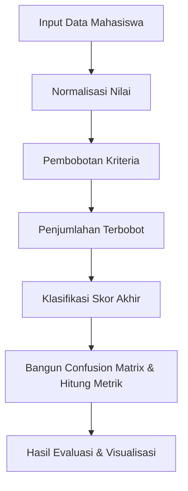

# 📊 Dokumentasi Proses Evaluasi SAW (Simple Additive Weighting)

## 1. Dasar Teori SAW
Simple Additive Weighting (SAW) adalah salah satu metode Multi Criteria Decision Making (MCDM) yang digunakan untuk menentukan peringkat atau klasifikasi berdasarkan penjumlahan bobot nilai setiap kriteria. Dalam aplikasi SPK, SAW digunakan untuk mengevaluasi peluang kelulusan mahasiswa berdasarkan parameter seperti IPK, SKS, dan DEK.

### Komponen Utama SAW:
- **Normalisasi**: Mengubah nilai asli ke skala perbandingan yang seragam (0-1).
- **Pembobotan**: Setiap kriteria diberi bobot sesuai tingkat kepentingan.
- **Penjumlahan Terbobot**: Nilai akhir dihitung dari penjumlahan hasil normalisasi dikali bobot.
- **Klasifikasi**: Nilai akhir dibandingkan threshold untuk menentukan kelas (Lulus/Tidak Lulus).

---

## 2. Rumus & Formula
### a. Normalisasi
Nilai asli setiap mahasiswa diubah ke skala 0-1 agar dapat dibandingkan secara adil antar kriteria.

- Untuk kriteria benefit (semakin besar semakin baik):
  
  $r_{ij} = \frac{x_{ij}}{x_{j}^{max}}$
  
  Di mana:
  - $r_{ij}$ = nilai normalisasi mahasiswa ke-$i$ pada kriteria ke-$j$
  - $x_{ij}$ = nilai asli mahasiswa ke-$i$ pada kriteria ke-$j$
  - $x_{j}^{max}$ = nilai maksimum pada kriteria ke-$j$

- Untuk kriteria cost (semakin kecil semakin baik):
  
  $r_{ij} = \frac{x_{j}^{min}}{x_{ij}}$
  
  Di mana:
  - $x_{j}^{min}$ = nilai minimum pada kriteria ke-$j$

**Interpretasi:**
- Nilai normalisasi akan berada di antara 0 dan 1.
- Untuk benefit, nilai terbesar akan menjadi 1.
- Untuk cost, nilai terkecil akan menjadi 1.

---

### b. Penjumlahan Terbobot
Setiap nilai normalisasi dikalikan bobot kriteria, lalu dijumlahkan untuk mendapatkan skor akhir.

$S_i = \sum_{j=1}^n w_j \cdot r_{ij}$

Di mana:
- $S_i$ = skor akhir mahasiswa ke-$i$
- $w_j$ = bobot kriteria ke-$j$ (jumlah seluruh bobot = 1)
- $r_{ij}$ = nilai normalisasi mahasiswa ke-$i$ pada kriteria ke-$j$

**Interpretasi:**
- Skor akhir merepresentasikan total performa mahasiswa berdasarkan semua kriteria dan bobotnya.

---

### c. Klasifikasi
Skor akhir dibandingkan dengan threshold untuk menentukan kelas:

- Jika $S_i \geq \text{threshold}$ → Lulus
- Jika $S_i < \text{threshold}$ → Tidak Lulus

**Interpretasi:**
- Threshold ditentukan berdasarkan analisis data atau kebijakan institusi.
- Klasifikasi akhir digunakan untuk evaluasi kelulusan dan analisis performa.

---

## 3. Logika Penghitungan di Aplikasi
1. **Input**: Data mahasiswa (IPK, SKS, DEK)
2. **Normalisasi**: Setiap nilai diubah ke skala 0-1 sesuai jenis kriteria (benefit/cost)
3. **Pembobotan**: Setiap kriteria dikalikan bobotnya
4. **Penjumlahan**: Semua nilai terbobot dijumlahkan untuk setiap mahasiswa
5. **Klasifikasi**: Skor akhir dibandingkan threshold untuk menentukan Lulus/Tidak Lulus

---

## 4. Implementasi pada Aplikasi SPK
- **Backend**: Implementasi logika SAW di `src/backend/saw_logic.py`, endpoint di `routers/saw.py`
- **Frontend**: Input data via form, hasil evaluasi ditampilkan di halaman evaluasi SAW
- **Visualisasi**: Hasil evaluasi, confusion matrix, metrik akurasi, dan narasi otomatis
- **Contoh Alur**:
  1. User input data mahasiswa
  2. Klik evaluasi SAW
  3. Backend melakukan normalisasi, pembobotan, penjumlahan, klasifikasi
  4. Hasil dikirim ke frontend, divisualisasikan dan dianalisis

---

## 5. Evaluasi Hasil: Confusion Matrix & Metrik Klasifikasi
### a. Teori Confusion Matrix
Confusion matrix digunakan untuk membandingkan hasil prediksi SAW dengan label aktual kelulusan mahasiswa.

|                | Prediksi Lulus | Prediksi Tidak Lulus |
|----------------|----------------|----------------------|
| **Lulus**      | TP             | FN                   |
| **Tidak Lulus**| FP             | TN                   |

### b. Rumus Metrik Evaluasi

- **Akurasi:**  
  $\text{Akurasi} = \frac{TP + TN}{TP + TN + FP + FN}$  
  Di mana:
  - $TP$ = True Positive (prediksi lulus & aktual lulus)
  - $TN$ = True Negative (prediksi tidak lulus & aktual tidak lulus)
  - $FP$ = False Positive (prediksi lulus & aktual tidak lulus)
  - $FN$ = False Negative (prediksi tidak lulus & aktual lulus)

- **Precision:**  
  $\text{Precision} = \frac{TP}{TP + FP}$  
  Mengukur ketepatan prediksi lulus.

- **Recall:**  
  $\text{Recall} = \frac{TP}{TP + FN}$  
  Mengukur kemampuan model menemukan semua mahasiswa yang benar-benar lulus.

- **F1-Score:**  
  $\text{F1-Score} = 2 \times \frac{\text{Precision} \times \text{Recall}}{\text{Precision} + \text{Recall}}$  
  Rata-rata harmonik antara precision dan recall, cocok untuk data tidak seimbang.

### c. Penghitungan di Aplikasi
1. Prediksi hasil klasifikasi SAW dibandingkan label aktual
2. Bangun confusion matrix dari hasil prediksi dan aktual
3. Hitung TP, TN, FP, FN
4. Hitung metrik akurasi, precision, recall, f1-score
5. Tampilkan hasil di frontend (tabel, badge, narasi)

#### Contoh Tabel Confusion Matrix
|                | Prediksi Lulus | Prediksi Tidak Lulus |
|----------------|----------------|----------------------|
| **Lulus**      | 110            | 20                   |
| **Tidak Lulus**| 18             | 52                   |

---

## 6. Flowchart Evaluasi SAW

---

## 7. Referensi
- Hwang, C.L. & Yoon, K. (1981). Multiple Attribute Decision Making: Methods and Applications.
- Dokumentasi kode `src/backend/saw_logic.py`

---

## 📅 Tanggal Update: 2025-07-21
## 📝 Kontributor: Tim Backend & Data Science 