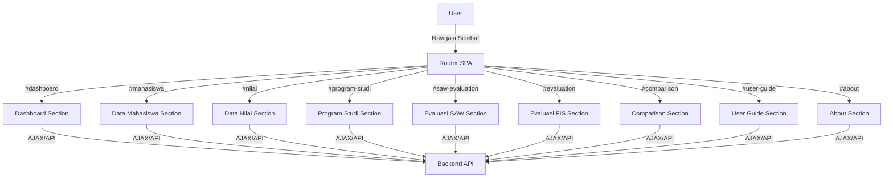

# 🎨 Dokumentasi Frontend - SPK Monitoring Masa Studi

## Ringkasan
Frontend aplikasi ini dibangun dengan konsep SPA (Single Page Application) menggunakan HTML5, CSS3, JavaScript, jQuery, Bootstrap, Kendo UI, dan Chart.js. Frontend bertanggung jawab untuk tampilan, interaksi user, dan integrasi ke backend melalui API.

---

## 🗺️ Diagram Flow SPA Frontend



---

## 📋 Tabel Komponen Utama Frontend

| Komponen/Section   | Fungsi Utama                                      |
|-------------------|---------------------------------------------------|
| Dashboard         | Statistik, grafik, status aplikasi                 |
| Data Mahasiswa    | Grid, form, filter, CRUD data mahasiswa           |
| Data Nilai        | Grid, form, filter, CRUD nilai mahasiswa          |
| Program Studi     | Manajemen prodi, jenjang, filter                  |
| Evaluasi SAW      | Proses evaluasi, visualisasi hasil, matrix, narasi|
| Evaluasi FIS      | Proses evaluasi FIS, matrix, narasi               |
| Comparison        | Analisis perbandingan hasil antar metode          |
| User Guide        | Panduan interaktif, narasi, tips, FAQ             |
| About             | Info aplikasi, teknologi, pengujian, tim          |

---

## 1. Teknologi Utama
- **HTML5, CSS3**: Struktur dan style dasar
- **JavaScript (ES6+)**: Logika interaktif
- **jQuery**: DOM manipulation & event handling
- **Bootstrap**: Layout responsif & komponen UI
- **Kendo UI**: Komponen grid, dropdown, notifikasi
- **FontAwesome**: Icon modern
- **Chart.js**: Visualisasi data & metrik

---

## 2. Struktur Direktori Frontend
```
src/frontend/
├── index.html           # SPA utama
├── js/                  # Script modular (dashboard, mahasiswa, nilai, saw, fis, evaluasi, dsb)
├── styles/              # CSS eksternal (kendo, font-awesome, bootstrap)
├── style.css            # Style utama aplikasi
├── style_complex.css    # Style tambahan/eksperimen
├── app.js               # Entry point SPA & router
```

---

## 3. Konsep SPA & Routing
- **SPA**: Semua halaman (dashboard, data, evaluasi, user guide, about) dalam satu file HTML
- **Router**: Navigasi hash-based, tanpa reload
- **Section**: Setiap halaman = 1 section, visibilitas diatur router
- **Sidebar**: Navigasi utama, konsisten di semua halaman

---

## 4. Komponen Utama
- **Dashboard**: Statistik, grafik, status aplikasi
- **Data Mahasiswa/Nilai/Prodi**: Grid, form, filter, CRUD
- **Evaluasi SAW/FIS**: Proses evaluasi, visualisasi confusion matrix, metrik, narasi
- **User Guide & About**: Panduan interaktif, info aplikasi
- **Comparison**: Analisis perbandingan hasil antar metode

---

## 5. Integrasi API
- **AJAX/jQuery**: Komunikasi ke backend FastAPI
- **Endpoint**: Semua data diambil/mutakhirkan via REST API
- **Error Handling**: Notifikasi Kendo, fallback alert

---

## 6. Style & Theme
- **Warna utama**: Biru-ungu (#667eea, #764ba2), aksen kuning/oranye
- **Card, badge, icon**: Konsisten di seluruh halaman
- **Responsif**: Bootstrap grid, media query
- **Custom style**: style.css untuk SPA, style_complex.css untuk eksperimen

---

## 7. Testing & Pengujian
- **Manual Test**: Uji coba fitur oleh user/operator
- **Test Otomatis**: Script test di js/ dan test HTML
- **Debugging**: Console log, DevTools, notifikasi error

---

## 8. Best Practice
- Struktur file modular & terorganisir
- Konsistensi UI/UX di seluruh halaman
- Validasi input user
- Error handling & feedback user
- Dokumentasi kode & fitur

---

## 📅 Tanggal Update: 2025-07-21
## 📝 Kontributor: Tim Frontend 